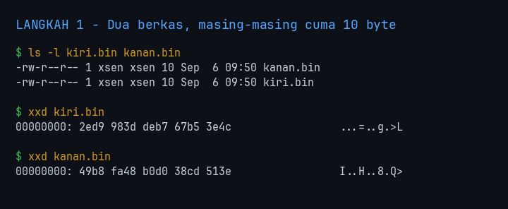
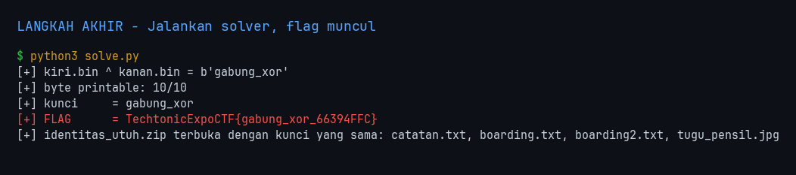
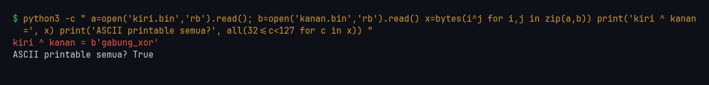
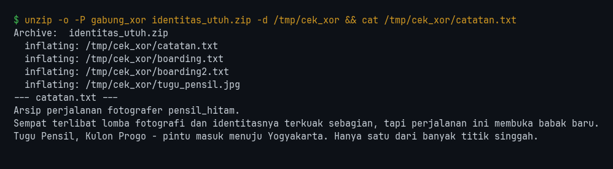

<!-- category: reverse | points: - -->
# Dua yang Satu

| | |
| :--- | :--- |
| **Challenge** | Dua yang Satu |
| **Kategori** | reverse |
| **Poin** | - |
| **Author** | - |
| **Connection** | file attachment: `kiri.bin`, `kanan.bin` |
| **Solver** | nexsus404 |
| **Status** | Solved |

> Dua berkas yang di-urutkan ulang. Gabungkan dengan operasi bitwise untuk membaca pesan.



---

## 1. Flag

```
TechtonicExpoCTF{gabung_xor_66394FFC}
```

> Flag **case-sensitive**. Tidak ada spasi/karakter tambahan saat submit.



---

## 2. Analisis Awal

- **Yang dikasih:** dua berkas mungil, `kiri.bin` dan `kanan.bin`, **masing-masing tepat 10 byte**. Plus sebuah arsip `identitas_utuh.zip` yang terkunci.
- **Observasi pertama:** `file` menyebut keduanya sebagai teks berkode aneh (`ISO-8859` dan `Non-ISO extended-ASCII`) — artinya isinya byte di luar ASCII, bukan teks sungguhan. Tidak ada header, tidak ada struktur.

```
kiri.bin   2e d9 98 3d de b7 67 b5 3e 4c
kanan.bin  49 b8 fa 48 b0 d0 38 cd 51 3e
```

- **Hipotesis awal:** deskripsi menyebut "operasi bitwise" untuk *menggabungkan* dua berkas. Dari semua operasi bitwise, hanya **XOR** yang masuk akal di sini. AND dan OR bersifat merusak — keduanya membuang informasi dan tidak bisa dibalik. XOR mempertahankan seluruh informasi dan merupakan pola one-time-pad standar: dua bagian yang masing-masing terlihat acak, tapi bermakna saat disatukan.

Panjang keduanya identik (10 byte) juga penunjuk kuat: XOR berpasangan menuntut panjang yang sama persis.

```
ls -l kiri.bin kanan.bin ; xxd kiri.bin ; xxd kanan.bin
```


---

## 3. Langkah Penyelesaian

### 3.1 XOR posisi-per-posisi

```
python3 -c "
a=open('kiri.bin','rb').read(); b=open('kanan.bin','rb').read()
x=bytes(i^j for i,j in zip(a,b))
print('kiri ^ kanan =', x)
print('ASCII printable semua?', all(32<=c<127 for c in x))
"
```

Hasil:

```
kiri ^ kanan = b'gabung_xor'
ASCII printable semua? True
```

Langsung terbaca, tanpa perlu perlakuan apa pun. Verifikasinya ada pada hasilnya sendiri: **10 dari 10 byte** jatuh di rentang ASCII printable dan membentuk kata Indonesia yang bermakna. XOR dua blob acak praktis mustahil menghasilkan itu secara kebetulan — peluang 10 byte acak semuanya printable saja sekitar 1 banding 30.000, apalagi tersusun jadi kata yang persis mendeskripsikan tekniknya sendiri.



### 3.2 Pesannya ternyata juga kunci arsip

Kata `gabung_xor` bukan sekadar pesan — ia password `identitas_utuh.zip` yang ikut dilampirkan:

```
unzip -o -P gabung_xor identitas_utuh.zip -d /tmp/cek_xor
cat /tmp/cek_xor/catatan.txt
```

Hasil: arsip terbuka berisi `catatan.txt`, `boarding.txt`, `boarding2.txt`, dan `tugu_pensil.jpg` — bahan untuk soal OSINT lanjutan. Ini mengonfirmasi ulang bahwa `gabung_xor` memang string yang dimaksud, bukan artefak kebetulan: server/arsip menerimanya sebagai password yang sah.



---

## 4. Tools & Script yang Digunakan

| Tool | Versi | Dipakai untuk |
| :--- | :--- | :--- |
| Python | 3.14.6 | XOR dua berkas (stdlib, tanpa dependensi) |
| xxd / file / ls | coreutils | recon awal, lihat byte mentah |
| unzip | 6.x | verifikasi pesan sebagai password arsip |

`solve.py`:

```
#!/usr/bin/env python3
"""Dua yang Satu - gabungkan dua berkas dengan XOR untuk memulihkan pesan.

Dua berkas berukuran sama yang masing-masing tampak acak = pola XOR berpasangan.
XOR bekerja per posisi, jadi bagian "di-urutkan ulang" pada deskripsi soal tidak
perlu dipulihkan: selama kedua berkas diacak dengan permutasi yang sama,
kiri[i] ^ kanan[i] tetap menghasilkan plain[i].
"""
import sys, zipfile

KIRI, KANAN, ARSIP = "kiri.bin", "kanan.bin", "identitas_utuh.zip"


def gabung(pa, pb):
    a, b = open(pa, "rb").read(), open(pb, "rb").read()
    if len(a) != len(b):
        sys.exit(f"[-] panjang beda ({len(a)} vs {len(b)}) - bukan pasangan XOR")
    return bytes(i ^ j for i, j in zip(a, b))


def main():
    pesan = gabung(KIRI, KANAN)
    print(f"[+] {KIRI} ^ {KANAN} = {pesan!r}")

    # Verifikasi: XOR dua blob acak nyaris mustahil menghasilkan ASCII penuh.
    # Peluang 10 byte acak semuanya printable ~ (95/256)^10 = 1 : 30.000.
    printable = sum(32 <= c < 127 for c in pesan)
    print(f"[+] byte printable: {printable}/{len(pesan)}")
    if printable != len(pesan):
        sys.exit("[-] hasil bukan teks bersih - operasi/pasangan salah")

    kunci = pesan.decode()
    print(f"[+] kunci     = {kunci}")
    print(f"[+] FLAG      = TechtonicExpoCTF{{{kunci}_66394FFC}}")

    # Konfirmasi kedua: pesan yang sama juga membuka arsip lanjutannya.
    try:
        with zipfile.ZipFile(ARSIP) as z:
            z.setpassword(kunci.encode())
            isi = z.namelist()
            z.read(isi[0])                      # lempar RuntimeError kalau salah
        print(f"[+] {ARSIP} terbuka dengan kunci yang sama: {', '.join(isi)}")
    except FileNotFoundError:
        print(f"[!] {ARSIP} tidak ada - lewati verifikasi arsip")
    except RuntimeError:
        print(f"[-] {ARSIP} menolak kunci - kunci mungkin salah")


if __name__ == "__main__":
    main()
```

---

## 5. Trial-and-Error / Langkah yang Gagal

| # | Yang dicoba | Hasil | Kenapa gagal / berhasil |
| :-- | :--- | :--- | :--- |
| 1 | Baca tiap berkas sendiri-sendiri (`strings`, `file`) | Gagal | Masing-masing memang dirancang tak bermakna sendirian — itu inti skema XOR berpasangan. |
| 2 | Cari cara "mengurutkan ulang" byte lebih dulu, sesuai kalimat soal | Tidak perlu | Lihat catatan di bawah. |
| 3 | XOR posisi-per-posisi langsung | **Berhasil** | Langsung menghasilkan `gabung_xor`, 10/10 byte printable. |

**Catatan soal #2 — bagian "di-urutkan ulang" itu pengalih perhatian.** Kalimat soal membuat saya sempat mengira ada permutasi yang harus dibetulkan dulu sebelum XOR. Ternyata tidak: XOR bekerja *per posisi*, jadi `kiri[i] ^ kanan[i]` menghasilkan `plain[i]` terlepas dari bagaimana pasangan-pasangan itu diurutkan. Selama kedua berkas diacak dengan permutasi yang **sama**, urutannya tidak pernah perlu dipulihkan.

Kalau saya menuruti kalimat itu secara harfiah, saya akan membuang waktu mencari kunci pengurutan yang tidak pernah ada. Yang menyelamatkan: mencoba operasi termurah lebih dulu (satu baris XOR) sebelum membangun teori yang rumit.

---

## 6. Insight Utama & Teknik Unik

- **Kunci soal ini:** dua berkas berukuran **persis sama** yang masing-masing terlihat acak hampir selalu berarti XOR berpasangan. Ukuran identik itu sinyalnya, dan "operasi bitwise" di deskripsi mempersempitnya — dari AND/OR/XOR, hanya XOR yang tidak merusak informasi sehingga hanya XOR yang bisa "menggabungkan" tanpa kehilangan.
- **Teknik unik:** memakai *keterbacaan hasil* sebagai verifikasi. Tidak ada checksum atau flag literal untuk dicocokkan, tapi 10 dari 10 byte mendarat di ASCII printable dan membentuk kata bermakna — itu bukti statistik yang cukup kuat, diperkuat lagi ketika string yang sama diterima sebagai password zip.
- **Pelajaran:** jangan percaya setiap kata di deskripsi soal secara harfiah. "Di-urutkan ulang" terdengar seperti langkah wajib, padahal sifat komutatif XOR per posisi membuatnya tidak relevan. **Coba operasi paling murah lebih dulu** — kalau satu baris kode menyelesaikannya, teori rumit yang sudah disiapkan tidak pernah perlu diuji.
- Pesan yang dipulihkan sering kali bukan tujuan akhir. Di sini `gabung_xor` sekaligus jadi password arsip yang membuka rantai soal berikutnya, jadi selalu periksa apakah hasil dekripsi punya kegunaan kedua.

---
