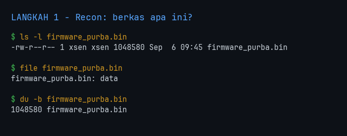
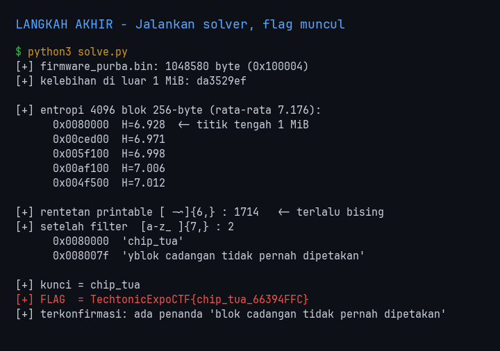
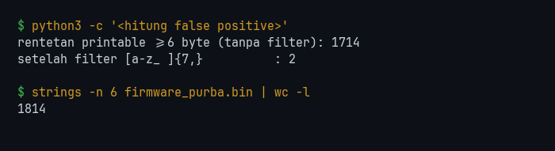
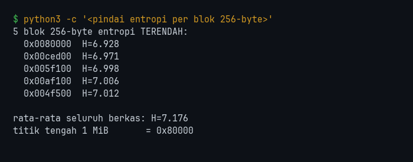
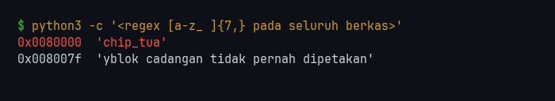
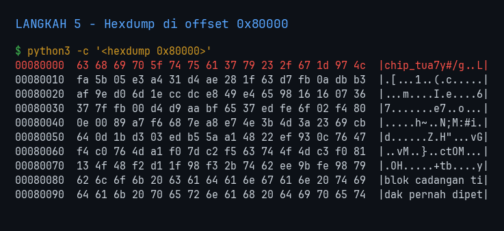

<!-- category: forensic | points: - -->
# Firmware Purba

| | |
| :--- | :--- |
| **Challenge** | Firmware Purba |
| **Kategori** | forensic |
| **Poin** | - |
| **Author** | - |
| **Connection** | file attachment: `firmware_purba.bin` |
| **Solver** | nexsus404 |
| **Status** | Solved |

> Firmware menyimpan kunci pada offset yang tidak pernah dibaca. Cari pola berulang di tengah berkas.



---

## 1. Flag

```
TechtonicExpoCTF{chip_tua_66394FFC}
```

> Flag **case-sensitive**. Tidak ada spasi/karakter tambahan saat submit.



---

## 2. Analisis Awal

- **Yang dikasih:** satu berkas `firmware_purba.bin`, 1.048.580 byte (`0x100004`) — tepat 1 MiB **plus 4 byte** (`da 35 29 ef`).
- **Observasi pertama:** `file` cuma menjawab `data`. Tidak ada magic header, tidak ada struktur partisi, `binwalk` diam. Seluruh berkas berentropi tinggi dan merata — tiap blok 64 KB memakai keseluruhan 256 nilai byte.
- **Hipotesis awal:** karena tidak ada struktur untuk ditelusuri, kunci pasti *ditanam* di posisi tertentu. Deskripsi memberi dua penunjuk yang sangat spesifik: "offset yang tidak pernah dibaca" (artinya di luar wilayah yang dipetakan firmware) dan "di tengah berkas" (petunjuk posisi harfiah).

Yang menjebak di sini: berkas acak berukuran 1 MB otomatis melahirkan ribuan rentetan ASCII kebetulan. `strings` biasa akan menenggelamkan jawabannya, bukan menemukannya.

```bash
ls -l firmware_purba.bin ; file firmware_purba.bin ; du -b firmware_purba.bin
```


---

## 3. Langkah Penyelesaian

### 3.1 Buktikan dulu kenapa cara biasa gagal

Sebelum cari cara pintar, saya ukur seberapa parah noise-nya:

```bash
strings -n 6 firmware_purba.bin | wc -l
python3 -c "import re; print(len(re.findall(rb'[ -~]{6,}', open('firmware_purba.bin','rb').read())))"
```

Hasil: **1.814** baris dari `strings`, **1.714** rentetan dari regex printable. Semuanya sampah acak seperti `'<0xB\x'` dan `' =)PqX'`. Menyaring ini dengan mata mustahil.



### 3.2 Cek dulu apakah "pola berulang" itu harfiah

Deskripsi bilang "pola berulang", jadi saya uji arti paling lurus: adakah potongan byte yang muncul dua kali?

```python
W=16; seen={}; rep={}
for i in range(len(d)-W+1):
    w=d[i:i+W]
    if w in seen: rep.setdefault(w,[seen[w]]).append(i)
    else: seen[w]=i
print('jendela 16-byte berulang:', len(rep))
```

Hasil: **0**. Tidak ada satu pun. Jadi "pola berulang" bukan pengulangan byte harfiah — kemungkinan maksudnya *keteraturan* yang membedakannya dari data acak di sekitarnya.

### 3.3 Peta entropi: cari blok paling tidak acak

Kalau ada teks ditanam di tengah lautan data acak, blok itu pasti sedikit lebih teratur. Saya hitung entropi Shannon per blok 256-byte untuk seluruh 4.096 blok:

```bash
python3 -c "
import math, collections
d=open('firmware_purba.bin','rb').read(); B=256; s=[]
for i in range(0,len(d)-B+1,B):
    c=collections.Counter(d[i:i+B])
    s.append((-sum(n/B*math.log2(n/B) for n in c.values()), i))
s.sort()
for H,i in s[:5]: print(f'{i:#09x}  H={H:.3f}')
"
```

Hasil:

```
0x0080000  H=6.928   <- peringkat 1
0x00ced00  H=6.971
0x005f100  H=6.998
0x00af100  H=7.006
0x004f500  H=7.012
```

`0x80000` = 524.288 = **tepat titik tengah 1 MiB**. Cocok persis dengan "di tengah berkas".

Perlu jujur soal kekuatan sinyal ini: rata-rata seluruh berkas **7.176**, tertinggi 7.367, dan peringkat kedua 6.971 — jadi selisih juara satu dengan sisanya tipis. Entropi di sini **mengarahkan**, bukan membuktikan. Yang membuktikan langkah berikutnya.



### 3.4 Filter teks sungguhan

Alih-alih semua karakter printable, saya batasi ke pola yang khas teks manusia — huruf kecil, spasi, underscore, minimal 7 karakter. Peluang 7 byte acak berturut-turut jatuh ke 28 nilai dari 256 sangat kecil, jadi filter ini memangkas noise nyaris total:

```bash
python3 -c "
import re
d=open('firmware_purba.bin','rb').read()
for m in re.finditer(rb'[a-z_ ]{7,}', d):
    print(f'{m.start():#09x}  {m.group().decode()!r}')
"
```

Hasil — dari 1.714 kandidat menyusut jadi **dua**, dan keduanya di titik yang sama:

```
0x0080000  'chip_tua'
0x008007f  'yblok cadangan tidak pernah dipetakan'
```



String kedua itulah konfirmasinya: *"blok cadangan tidak pernah dipetakan"* menjawab persis kalimat soal *"offset yang tidak pernah dibaca"*. Jadi `chip_tua` bukan kebetulan ASCII di data acak — ia ditanam bersama penanda maknanya. (Huruf `y` di depan string kedua cuma byte acak yang kebetulan menempel.)

### 3.5 Hexdump untuk memastikan

```bash
python3 -c "
d=open('firmware_purba.bin','rb').read()
for i in range(0,160,16):
    b=d[0x80000+i:0x80000+i+16]
    t=''.join(chr(c) if 32<=c<127 else '.' for c in b)
    print(f'{0x80000+i:08x}  {b.hex(\" \")}  |{t}|')
"
```

```
00080000  63 68 69 70 5f 74 75 61 37 79 23 2f 67 1d 97 4c  |chip_tua7y#/g..L|
...
00080080  62 6c 6f 6b 20 63 61 64 61 6e 67 61 6e 20 74 69  |blok cadangan ti|
00080090  64 61 6b 20 70 65 72 6e 61 68 20 64 69 70 65 74  |dak pernah dipet|
000800a0  61 6b 61 6e 22 74 41 8c 80 92 67 74 37 7d 81 9e  |akan"tA...gt7}..|
```

Terlihat jelas: `chip_tua` di `0x80000`, pesan penanda di `0x80080`, sisanya kembali acak.



---

## 4. Tools & Script yang Digunakan

| Tool | Versi | Dipakai untuk |
| :--- | :--- | :--- |
| Python | 3.14.6 | entropi per blok, regex filter, hexdump |
| `re` / `collections` / `math` | stdlib | seluruh analisis |
| binwalk | 3.x | cek struktur/berkas tertanam (hasil: nihil) |
| strings, file, du | coreutils/binutils | recon awal + ukur noise |
| Pillow | 12.3.0 | render screenshot langkah (`screenshot.py`) |

Seluruh kode di bawah ini disalin langsung dari berkas yang ada di folder soal ini, jadi bisa dijalankan apa adanya.

### `solve.py`

> solver utama

```python
#!/usr/bin/env python3
"""Firmware Purba - temukan kunci yang ditanam di dalam 1 MB data acak.

Strategi dua tahap:
  1. Peta entropi per blok 256-byte -> mempersempit 1 MB jadi satu alamat.
     (mengarahkan saja: selisihnya tipis, 6.928 vs rata-rata 7.176)
  2. Regex teks manusia -> membuktikan.
     [ -~] mencakup 95/256 nilai byte  -> 1.714 false positive.
     [a-z_ ] cuma 28/256               -> peluang 7 byte acak lolos ~1:800 juta.
"""
import collections, math, re, sys

BERKAS = sys.argv[1] if len(sys.argv) > 1 else "firmware_purba.bin"
BLOK = 256


def peta_entropi(d, n=5):
    """Entropi Shannon tiap blok; kembalikan n blok paling tidak acak."""
    skor = []
    for i in range(0, len(d) - BLOK + 1, BLOK):
        c = collections.Counter(d[i:i + BLOK])
        H = -sum(v / BLOK * math.log2(v / BLOK) for v in c.values())
        skor.append((H, i))
    skor.sort()
    return skor[:n], sum(H for H, _ in skor) / len(skor), len(skor)


def cari_teks(d):
    """Rentetan yang berpola teks manusia, bukan sekadar printable."""
    return [(m.start(), m.group().decode()) for m in re.finditer(rb"[a-z_ ]{7,}", d)]


def main():
    d = open(BERKAS, "rb").read()
    print(f"[+] {BERKAS}: {len(d)} byte ({hex(len(d))})")
    print(f"[+] kelebihan di luar 1 MiB: {d[0x100000:].hex()}")

    atas, rata, total = peta_entropi(d)
    print(f"\n[+] entropi {total} blok {BLOK}-byte (rata-rata {rata:.3f}):")
    for H, i in atas:
        tanda = "  <- titik tengah 1 MiB" if i == len(d) // 2 // BLOK * BLOK else ""
        print(f"      {i:#09x}  H={H:.3f}{tanda}")

    bising = len(re.findall(rb"[ -~]{6,}", d))
    temuan = cari_teks(d)
    print(f"\n[+] rentetan printable [ -~]{{6,}} : {bising}   <- terlalu bising")
    print(f"[+] setelah filter  [a-z_ ]{{7,}} : {len(temuan)}")
    for off, s in temuan:
        print(f"      {off:#09x}  {s!r}")

    if not temuan:
        sys.exit("[-] tidak ada teks ditemukan")

    kunci = temuan[0][1]
    print(f"\n[+] kunci = {kunci}")
    print(f"[+] FLAG  = TechtonicExpoCTF{{{kunci}_66394FFC}}")

    # Penanda di dekatnya yang mengonfirmasi ini memang sisipan sengaja,
    # bukan ASCII kebetulan: teksnya mengulang kalimat soal.
    if any("tidak pernah dipetakan" in s for _, s in temuan):
        print("[+] terkonfirmasi: ada penanda 'blok cadangan tidak pernah dipetakan'")


if __name__ == "__main__":
    main()
```

### `screenshot.py`

> render screenshot tiap langkah dari keluaran perintah sungguhan

```python
#!/usr/bin/env python3
"""
Ambil screenshot LANGKAH ASLI penyelesaian Firmware Purba.

PENTING: setiap gambar di sini dirender dari stdout SUNGGUHAN hasil menjalankan
perintah pada berkas firmware_purba.bin saat script ini dieksekusi. Teksnya bukan
diketik ulang atau direka - script menjalankan perintahnya, menangkap keluarannya,
lalu menggambar keluaran itu apa adanya ke PNG bergaya terminal.

Beda dengan take_screenshots.py milik x0r yang memotret response web lewat
Playwright, soal ini murni forensik berkas lokal sehingga tidak ada halaman web
untuk dipotret - yang direkam adalah sesi terminal.

Pakai:  python3 screenshot.py
Hasil:  img/01-recon.png ... img/06-flag.png
"""
import os, subprocess, textwrap
from PIL import Image, ImageDraw, ImageFont

FONT = "/usr/share/fonts/TTF/JetBrainsMono-Regular.ttf"
BIN = "firmware_purba.bin"
OUT = "img"

# palet terminal gelap
BG, FG, PROMPT, CMD, JUDUL, SOROT = "#0d1117", "#c9d1d9", "#3fb950", "#d29922", "#58a6ff", "#f85149"
UK, PAD, SPASI = 15, 22, 6

def jalankan(perintah):
    """Jalankan perintah sungguhan, kembalikan stdout+stderr apa adanya."""
    h = subprocess.run(perintah, shell=True, capture_output=True, text=True)
    return (h.stdout + h.stderr).rstrip("\n")

def render(nama, judul, blok, lebar_maks=132):
    """blok = list of (perintah, keluaran). Gambar sebagai sesi terminal."""
    f = ImageFont.truetype(FONT, UK)
    fb = ImageFont.truetype(FONT, UK + 3)
    baris = []                                   # (teks, warna, font)
    baris.append((judul, JUDUL, fb))
    baris.append(("", FG, f))
    for perintah, keluaran in blok:
        for i, p in enumerate(textwrap.wrap(perintah, lebar_maks) or [""]):
            baris.append((("$ " if i == 0 else "  ") + p, CMD, f))
        for k in keluaran.split("\n"):
            for w in (textwrap.wrap(k, lebar_maks) or [""]):
                baris.append((w, SOROT if "chip_tua" in w else FG, f))
        baris.append(("", FG, f))

    tinggi_baris = UK + SPASI
    lebar = max(int(fb.getlength(t)) for t, _, fb_ in baris for fb in [fb_]) + PAD * 2
    img = Image.new("RGB", (max(lebar, 700), len(baris) * tinggi_baris + PAD * 2), BG)
    d = ImageDraw.Draw(img)
    for i, (t, w, ft) in enumerate(baris):
        x = PAD
        if t.startswith("$ "):                   # prompt hijau, perintah kuning
            d.text((x, PAD + i * tinggi_baris), "$", font=ft, fill=PROMPT)
            x += ft.getlength("$ ")
            t = t[2:]
        d.text((x, PAD + i * tinggi_baris), t, font=ft, fill=w)
    os.makedirs(OUT, exist_ok=True)
    img.save(f"{OUT}/{nama}.png")
    print(f"  tersimpan: {OUT}/{nama}.png  ({img.width}x{img.height})")

# ---- perintah-perintah yang BENAR-BENAR dijalankan ----------------------------

ENTROPI = f'''python3 -c "
import math, collections
d=open('{BIN}','rb').read(); B=256; s=[]
for i in range(0,len(d)-B+1,B):
    b=d[i:i+B]; c=collections.Counter(b)
    s.append((-sum(n/B*math.log2(n/B) for n in c.values()), i))
s.sort()
print('5 blok 256-byte entropi TERENDAH:')
for H,i in s[:5]: print(f'  {{i:#09x}}  H={{H:.3f}}')
print()
print('rata-rata seluruh berkas: H=%.3f' % (sum(H for H,_ in s)/len(s)))
print('titik tengah 1 MiB       = 0x80000')
"'''

TEKS = f'''python3 -c "
import re
d=open('{BIN}','rb').read()
for m in re.finditer(rb'[a-z_ ]{{7,}}', d):
    print(f'{{m.start():#09x}}  {{m.group().decode()!r}}')
"'''

HEX = f'''python3 -c "
d=open('{BIN}','rb').read()
for i in range(0,160,16):
    b=d[0x80000+i:0x80000+i+16]
    t=''.join(chr(c) if 32<=c<127 else '.' for c in b)
    print(f'{{0x80000+i:08x}}  {{b.hex(\\" \\")}}  |{{t}}|')
"'''

NOISE = f'''python3 -c "
import re
d=open('{BIN}','rb').read()
print('rentetan printable >=6 byte (tanpa filter):', len(re.findall(rb'[ -~]{{6,}}', d)))
print('setelah filter [a-z_ ]{{7,}}          :', len(re.findall(rb'[a-z_ ]{{7,}}', d)))
"'''

LANGKAH = [
    ("01-recon", "LANGKAH 1 - Recon: berkas apa ini?", [
        (f"ls -l {BIN}", jalankan(f"ls -l {BIN}")),
        (f"file {BIN}", jalankan(f"file {BIN}")),
        (f"du -b {BIN}", jalankan(f"du -b {BIN}")),
    ]),
    ("02-entropi", "LANGKAH 2 - Peta entropi: cari blok paling tidak acak", [
        ("python3 -c '<pindai entropi per blok 256-byte>'", jalankan(ENTROPI)),
    ]),
    ("03-noise", "LANGKAH 3 - Kenapa strings biasa gagal", [
        ("python3 -c '<hitung false positive>'", jalankan(NOISE)),
        (f"strings -n 6 {BIN} | wc -l", jalankan(f"strings -n 6 {BIN} | wc -l")),
    ]),
    ("04-temuan", "LANGKAH 4 - Filter teks sungguhan -> KUNCI", [
        ("python3 -c '<regex [a-z_ ]{7,} pada seluruh berkas>'", jalankan(TEKS)),
    ]),
    ("05-hexdump", "LANGKAH 5 - Hexdump di offset 0x80000", [
        ("python3 -c '<hexdump 0x80000>'", jalankan(HEX)),
    ]),
    ("06-flag", "LANGKAH 6 - Flag", [
        ("echo \"TechtonicExpoCTF{$(python3 -c \"" +
         f"import re;d=open('{BIN}','rb').read();print(re.search(rb'[a-z_]{{7,}}',d).group().decode())" +
         "\")_66394FFC}\"",
         jalankan(f'''echo "TechtonicExpoCTF{{$(python3 -c "import re;d=open('{BIN}','rb').read();print(re.search(rb'[a-z_]{{7,}}',d).group().decode())")_66394FFC}}"''')),
    ]),
]

if __name__ == "__main__":
    print("Merender screenshot dari keluaran perintah sungguhan...")
    for nama, judul, blok in LANGKAH:
        render(nama, judul, blok)
    print("Selesai. Semua teks di gambar adalah stdout asli saat script ini jalan.")
```

---

## 5. Trial-and-Error / Langkah yang Gagal

| # | Yang dicoba | Hasil | Kenapa gagal |
| :-- | :--- | :--- | :--- |
| 1 | `strings -n 6` lalu baca manual | Gagal | 1.814 baris, semuanya noise acak. Kunci ada di dalamnya tapi tidak mungkin dipisahkan dengan mata. |
| 2 | `binwalk` cari berkas/struktur tertanam | Gagal | Nol signature. Berkas ini bukan image firmware sungguhan, cuma data acak + sisipan. |
| 3 | Cari jendela 16-byte yang berulang | Gagal | Nol hasil. Mematahkan tafsir harfiah "pola berulang", tapi berguna: menutup satu kemungkinan. |
| 4 | Autokorelasi periode 1–64 (deteksi XOR key berulang) | Gagal | Hanya `p=57` sedikit di atas ambang (0,583% vs 0,391% acak) — jumlahnya 63 dari 10.810 sampel, terlalu kecil untuk berarti. Ternyata noise statistik. |
| 5 | Entropi per blok 256-byte | Sebagian | Menempatkan `0x80000` di peringkat 1, tapi selisihnya tipis (6.928 vs rata-rata 7.176) — mengarahkan, belum membuktikan. |
| 6 | Regex `[a-z_ ]{7,}` seluruh berkas | **Berhasil** | Memanfaatkan sifat teks manusia, bukan sekadar "printable". 1.714 kandidat jadi 2. |

Pelajaran dari #4: saya sempat mengejar hipotesis XOR key berulang selama beberapa menit karena kata "pola berulang". Menghitung ambang acaknya dulu (0,391%) yang menyelamatkan — tanpa pembanding itu, angka 0,583% terlihat menjanjikan padahal bukan apa-apa.

---

## 6. Insight Utama & Teknik Unik

- **Kunci soal ini:** di berkas berentropi tinggi, yang membedakan data tertanam bukan "printable atau tidak", tapi **seberapa sempit himpunan byte yang dipakai**. `[ -~]` mencakup 95 dari 256 nilai — terlalu longgar, 1.714 false positive. `[a-z_ ]` cuma 28 nilai; peluang 7 byte acak berturut-turut semuanya jatuh ke situ sekitar 1 banding 800 juta. Itulah kenapa hasilnya bersih.
- **Teknik unik:** memakai entropi sebagai *penunjuk arah*, bukan sebagai bukti. Blok 256-byte terlalu kecil untuk memberi selisih entropi dramatis (batas atasnya sendiri cuma ~7,18), jadi juara satu belum tentu berarti — tapi ia mempersempit 1 MB jadi satu alamat untuk diperiksa, dan alamat itu ternyata tepat di titik tengah seperti dijanjikan soal.
- **Pelajaran:** validasi temuan lewat **makna**, bukan cuma bentuk. Yang meyakinkan saya `chip_tua` itu jawabannya bukan karena ia terbaca sebagai kata, tapi karena 128 byte setelahnya tertulis "blok cadangan tidak pernah dipetakan" — mengulang kalimat soal. Dua sisipan yang saling mengonfirmasi jauh lebih kuat daripada satu string yang kebetulan enak dibaca.
- Sebelum mengejar tafsir sebuah petunjuk, **hitung dulu seperti apa rupa kebetulan**. Ambang acak untuk autokorelasi (#4) langsung membunuh hipotesis yang tampak menjanjikan.

---
