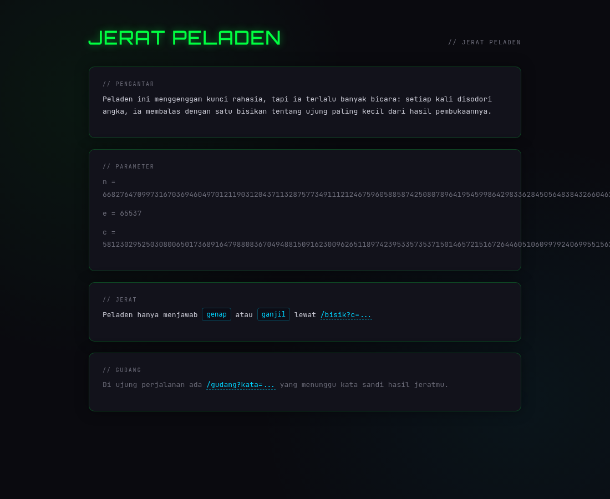
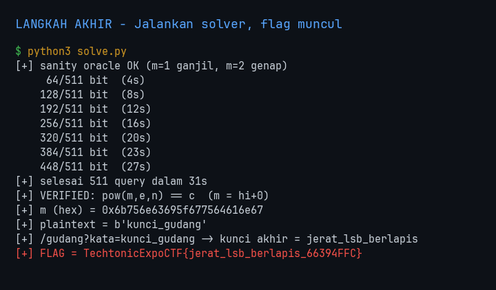
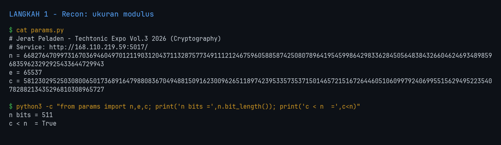
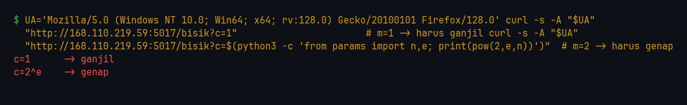
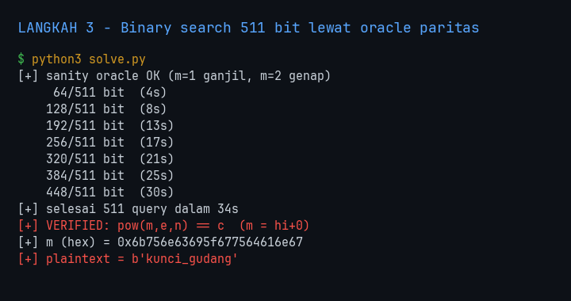

<!-- category: crypto | points: - -->
# Jerat Peladen

| | |
| :--- | :--- |
| **Challenge** | Jerat Peladen |
| **Kategori** | crypto |
| **Poin** | - |
| **Author** | - |
| **Connection** | http://168.110.219.59:5017/ |
| **Solver** | nexsus404 |
| **Status** | Solved |

> Peladen ini memegang kunci rahasia di dalam tabung RSA, tapi ia terlalu banyak bicara. Setiap kali disodori angka, ia hanya membalas satu hal: apakah hasil pembukaannya genap atau ganjil.
>
> Satu bit per jawaban terdengar sepele. Tapi dari ribuan bisikan kecil itu, seluruh pesan bisa disusun kembali. Pangkal pesan menyimpan kata sandi gudang.
>
> Kata sandi itu lalu membuka gudang di ujung perjalanan, tempat kunci terakhir menunggu.



---

## 1. Flag

```
TechtonicExpoCTF{jerat_lsb_berlapis_66394FFC}
```

> Flag **case-sensitive**. Tidak ada spasi/karakter tambahan saat submit.



---

## 2. Analisis Awal

- **Yang dikasih:** satu service HTTP di `http://168.110.219.59:5017/` berisi `n`, `e`, `c`, plus dua endpoint: `/bisik?c=...` dan `/gudang?kata=...`.
- **Observasi pertama:** `/bisik` mengembalikan tepat satu kata — `genap` atau `ganjil`. Itu bukan pesan error, itu **paritas dari hasil dekripsi**. Server dengan sukarela membocorkan LSB dari `c^d mod n` untuk ciphertext apa pun yang saya kirim.
- **Hipotesis awal:** ini **RSA LSB (parity) oracle attack**. Kalau saya bisa menanyakan paritas `m` untuk ciphertext pilihan saya sendiri, saya bisa mengalikan plaintext dengan 2 berulang kali dan melakukan binary search pada nilai `m` — tanpa perlu memfaktorkan `n` sama sekali.

Kenapa hipotesis itu langsung kuat: RSA bersifat *homomorphic* terhadap perkalian. `(c · 2^e) mod n` mendekripsi menjadi `(2m) mod n`. Nilai `2m` selalu genap, jadi kalau oracle menjawab **ganjil**, satu-satunya penjelasan adalah terjadi reduksi modulo — artinya `2m > n`, artinya `m > n/2`. Satu bit jawaban = satu bit posisi `m`.

Perintah recon paling awal:

```bash
UA="Mozilla/5.0 (Windows NT 10.0; Win64; x64; rv:128.0) Gecko/20100101 Firefox/128.0"
curl -s -A "$UA" http://168.110.219.59:5017/
```

Hasil: halaman parameter, `n` = 511 bit, `e` = 65537, `c < n`.



---

## 3. Langkah Penyelesaian

### 3.1 Rekam parameter dan cek ukurannya

`params.py`:

```python
n = 6682764709973167036946049701211903120437113287577349111212467596058858742508078964195459986429833628450564838432660462469348985968359623292925433644729943
e = 65537
c = 5812302952503080065017368916479880836704948815091623009626511897423953357353715014657215167264460510609979240699551562949522354078288213435296810308965727
```

```bash
python3 -c "from params import n,e,c; print(n.bit_length(), c.bit_length(), c<n)"
```

Hasil: `511 511 True`. Modulus 511 bit → butuh **511 query** untuk mempersempit `m` sampai satu nilai.

### 3.2 Kalibrasi oracle sebelum dipakai serius

Saya tidak mau membakar 511 query di atas asumsi yang salah, jadi saya uji oracle dengan dua plaintext yang sudah saya tahu jawabannya. `c = 1` mendekripsi jadi `m = 1` (ganjil), dan `c = 2^e mod n` mendekripsi jadi `m = 2` (genap).

```bash
curl -s -A "$UA" "http://168.110.219.59:5017/bisik?c=1"
curl -s -A "$UA" "http://168.110.219.59:5017/bisik?c=$(python3 -c 'from params import n,e; print(pow(2,e,n))')"
```

Hasil: `ganjil` lalu `genap`. Oracle jujur dan arah interpretasinya benar.



### 3.3 Binary search 511 bit

Invariannya: pertahankan interval `[lo, hi)` yang pasti memuat `m`. Di iterasi ke-`i` saya kirim `c · 2^(i·e) mod n`, yang mendekripsi jadi `2^i · m mod n`.

- jawaban **genap** → tidak ada reduksi mod → `m` ada di paruh **bawah** → `hi = tengah`
- jawaban **ganjil** → terjadi reduksi mod → `m` ada di paruh **atas** → `lo = tengah`

```bash
python3 solve.py
```

Hasil:

```
[+] sanity oracle OK (m=1 ganjil, m=2 genap)
     64/511 bit  (4s)
    ...
    448/511 bit  (30s)
[+] selesai 511 query dalam 34s
[+] VERIFIED: pow(m,e,n) == c  (m = hi+0)
[+] m (hex) = 0x6b756e63695f677564616e67
[+] plaintext = b'kunci_gudang'
```

Saya tidak berhenti di "hasilnya kelihatan seperti teks". Solver mengenkripsi ulang kandidatnya dan membandingkan dengan `c` asli — `pow(m, e, n) == c` cocok persis, jadi `m` yang direkonstruksi memang benar, bukan kebetulan yang mirip ASCII.

### 3.4 Buka gudang

"Pangkal pesan menyimpan kata sandi gudang" — plaintextnya pendek, jadi seluruh pesan itu sendiri kata sandinya.

```bash
curl -s -A "$UA" "http://168.110.219.59:5017/gudang?kata=kunci_gudang" \
  | sed -e 's|</p>|</p>\n|g' -e 's/<[^>]*>//g' | grep -v '^\s*$'
```

Hasil:

```
Gudang Terbuka// JERAT PELADEN// KUNCI AKHIR
Gudang terbuka. Bendera di tanganmu: jerat_lsb_berlapis
```

Langkah ini kemudian saya masukkan ke dalam `solve.py`, jadi satu kali jalan sudah
menghasilkan flag utuh tanpa perlu `curl` manual (lihat gambar di bagian 1).



---

## 4. Tools & Script yang Digunakan

| Tool | Versi | Dipakai untuk |
| :--- | :--- | :--- |
| Python | 3.14.6 | solver LSB oracle |
| `fractions.Fraction` | stdlib | batas binary search eksak (lihat bagian 5) |
| `urllib.request` | stdlib | 511 query berurutan ke oracle |
| curl | - | recon awal + buka `/gudang` |
| sympy | 1.14.0 | bangkitkan kunci RSA lokal untuk uji pembulatan |

`params.py`:

```python
# Jerat Peladen - Techtonic Expo Vol.3 2026 (Cryptography)
# Service: http://168.110.219.59:5017/
n = 6682764709973167036946049701211903120437113287577349111212467596058858742508078964195459986429833628450564838432660462469348985968359623292925433644729943
e = 65537
c = 5812302952503080065017368916479880836704948815091623009626511897423953357353715014657215167264460510609979240699551562949522354078288213435296810308965727
```

`solve.py`:

```python
#!/usr/bin/env python3
"""Jerat Peladen - RSA LSB (parity) oracle attack."""
import re, sys, time
from fractions import Fraction
import urllib.request
from params import n, e, c

BASE = "http://168.110.219.59:5017"
UA = "Mozilla/5.0 (Windows NT 10.0; Win64; x64; rv:128.0) Gecko/20100101 Firefox/128.0"
POLA = re.compile(r'// BISIKAN.*?<p class="abu">(\w+)</p>', re.S)

def bisik(ct, retry=5):
    """Tanya paritas m = ct^d mod n. True = ganjil (LSB 1)."""
    for i in range(retry):
        try:
            req = urllib.request.Request(f"{BASE}/bisik?c={ct}", headers={"User-Agent": UA})
            body = urllib.request.urlopen(req, timeout=20).read().decode()
            m = POLA.search(body)
            if not m:
                raise ValueError("jawaban tak terbaca: " + body[:200])
            return m.group(1) == "ganjil"
        except Exception as ex:
            if i == retry - 1:
                raise
            time.sleep(1 + i)

# sanity check: m=1 ganjil, m=2 genap
assert bisik(1) is True,  "sanity m=1 gagal"
assert bisik(pow(2, e, n)) is False, "sanity m=2 gagal"
print("[+] sanity oracle OK (m=1 ganjil, m=2 genap)", flush=True)

dua_e = pow(2, e, n)
lo, hi = Fraction(0), Fraction(n)
ct = c
bits = n.bit_length()
t0 = time.time()

for i in range(bits):
    ct = (ct * dua_e) % n          # kalikan m dengan 2
    tengah = (lo + hi) / 2
    if bisik(ct):                  # ganjil -> terjadi reduksi mod n -> m di paruh atas
        lo = tengah
    else:                          # genap -> tanpa reduksi -> m di paruh bawah
        hi = tengah
    if (i + 1) % 64 == 0:
        print(f"    {i+1:3d}/{bits} bit  ({time.time()-t0:.0f}s)", flush=True)

m = int(hi)
print(f"[+] selesai {bits} query dalam {time.time()-t0:.0f}s", flush=True)

for kand in (m, m - 1, m + 1):
    if pow(kand, e, n) == c:
        print(f"[+] VERIFIED: pow(m,e,n) == c  (m = hi{kand-m:+d})")
        m = kand
        break
else:
    print("[!] verifikasi gagal, m mungkin meleset", file=sys.stderr)

data = m.to_bytes((m.bit_length() + 7) // 8, "big")
print("[+] m (hex) =", hex(m))
print("[+] plaintext =", repr(data))
open("pesan.bin", "wb").write(data)

# Plaintext-nya adalah kata sandi gudang; tukarkan ke bendera akhir.
kata = data.decode()
req = urllib.request.Request(f"{BASE}/gudang?kata={kata}", headers={"User-Agent": UA})
halaman = urllib.request.urlopen(req, timeout=20).read().decode()
bendera = re.search(r"Bendera di tanganmu:\s*<code>([^<]+)</code>", halaman)
if not bendera:
    bendera = re.search(r"Bendera di tanganmu:\s*([\w_]+)", halaman)
kunci = bendera.group(1).strip()
print(f"[+] /gudang?kata={kata} -> kunci akhir = {kunci}")
print(f"[+] FLAG = TechtonicExpoCTF{{{kunci}_66394FFC}}")
```

`uji_pembulatan.py`:

```python
#!/usr/bin/env python3
"""Simulasi lokal: bandingkan binary search versi integer // vs Fraction.
Pakai kunci RSA buatan sendiri supaya oracle bisa dijalankan offline."""
from fractions import Fraction
import random, sympy

random.seed(1337)
gagal_int = gagal_frac = 0
for percobaan in range(20):
    p, q = sympy.randprime(2**255, 2**256), sympy.randprime(2**255, 2**256)
    N, E = p*q, 65537
    d = pow(E, -1, (p-1)*(q-1))
    m0 = int.from_bytes(b"kunci_gudang", "big")
    c0 = pow(m0, E, N)
    orc = lambda ct: pow(ct, d, N) & 1     # oracle paritas lokal
    dua = pow(2, E, N)

    # versi A: integer floor division
    lo, hi, ct = 0, N, c0
    for _ in range(N.bit_length()):
        ct = ct * dua % N
        mid = (lo + hi) // 2
        if orc(ct): lo = mid
        else:       hi = mid
    if pow(hi, E, N) != c0: gagal_int += 1

    # versi B: Fraction (eksak)
    lo, hi, ct = Fraction(0), Fraction(N), c0
    for _ in range(N.bit_length()):
        ct = ct * dua % N
        mid = (lo + hi) / 2
        if orc(ct): lo = mid
        else:       hi = mid
    if pow(int(hi), E, N) != c0: gagal_frac += 1

print(f"versi integer //  : {gagal_int}/20 gagal")
print(f"versi Fraction    : {gagal_frac}/20 gagal")
```

---

## 5. Trial-and-Error / Langkah yang Gagal

| # | Yang dicoba | Hasil | Kenapa gagal |
| :-- | :--- | :--- | :--- |
| 1 | Cari endpoint soal lewat platform: `curl https://techtonicexpo.online/tantangan` | Gagal | Balas `307 Temporary Redirect` ke `/masuk`. Daftar challenge ada di balik login, dan halaman login Next.js kirim kredensial ke `/api/masuk` — jalur ini muter jauh sebelum sampai ke soal. Ditinggal begitu URL service didapat langsung. |
| 2 | Binary search pakai integer `//` (`mid = (lo+hi)//2`) | Gagal | Pembulatan ke bawah tiap iterasi menumpuk. Setelah 511 iterasi, error akumulatifnya melewati 1, jadi `hi` mendarat di angka yang salah. |
| 3 | Binary search pakai `Fraction` | **Berhasil** | Batas interval tetap eksak sepanjang 511 iterasi, `int(hi)` mendarat tepat di `m`. |

Poin #2 tidak saya tebak — saya ukur. Karena oracle asli tidak bisa dipakai bereksperimen bebas (tiap tes = 511 request ke server panitia), saya bangkitkan kunci RSA 512-bit sendiri, jalankan oracle paritas secara lokal, lalu adu kedua versi pada 20 kunci acak:

```bash
python3 uji_pembulatan.py
```

```
versi integer //  : 20/20 gagal
versi Fraction    : 0/20 gagal
```

Jadi bukan "kadang meleset" — versi integer gagal **setiap kali**. Itulah alasan `Fraction` dipakai di solver final, dan alasan solver tetap punya jaring pengaman `m-1 / m / m+1` sebelum menyatakan berhasil.

---

## 6. Insight Utama & Teknik Unik

- **Kunci soal ini:** RSA itu homomorphic terhadap perkalian, jadi `c · 2^e mod n` mendekripsi jadi `2m mod n`. Karena `2m` mustahil ganjil secara alami, jawaban "ganjil" hanya bisa berarti terjadi reduksi modulo — dan itu memberi tahu `m` ada di paruh atas atau bawah interval. Satu bit bocor per query × 511 query = seluruh plaintext, **tanpa memfaktorkan `n`**.
- **Teknik unik:** kalibrasi oracle dengan plaintext yang sudah diketahui (`c=1` → `m=1`, `c=2^e` → `m=2`) sebelum menembakkan 511 query. Ini memastikan arah interpretasi genap/ganjil tidak kebalik — kalau kebalik, hasilnya tetap "sukses" tanpa error, cuma plaintextnya sampah, dan debugnya mahal.
- **Pelajaran:** di serangan yang mempersempit interval selama ratusan iterasi, **presisi aritmetika itu bagian dari eksploitnya**, bukan detail implementasi. Dan selalu tutup solver dengan verifikasi mandiri (`pow(m,e,n) == c`) — plaintext yang "kelihatan benar" bukan bukti; enkripsi ulang yang cocok, itu bukti.
- Oracle satu-bit tampak tidak berbahaya bagi yang mendesain server. Mitigasinya: padding (OAEP) yang membuat ciphertext hasil manipulasi ditolak sebelum sempat dijawab paritasnya.

---
