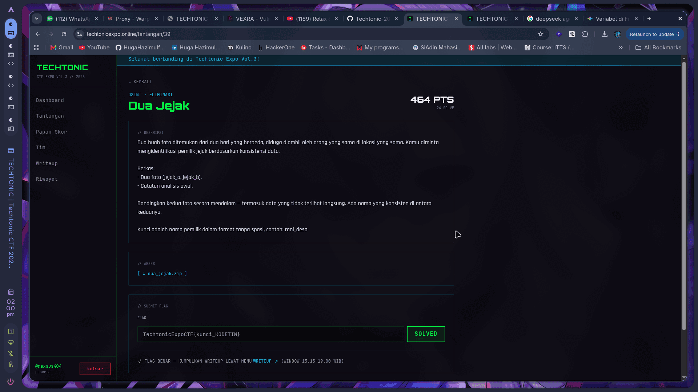
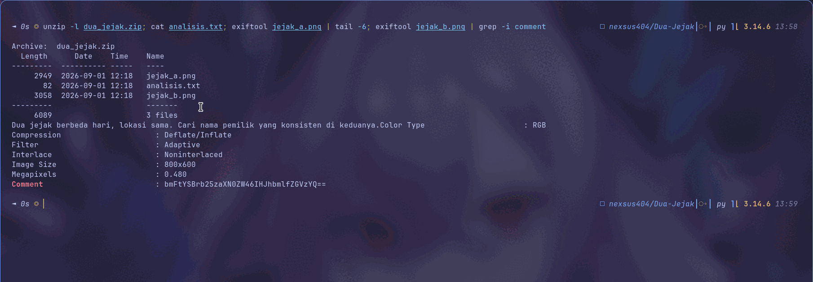
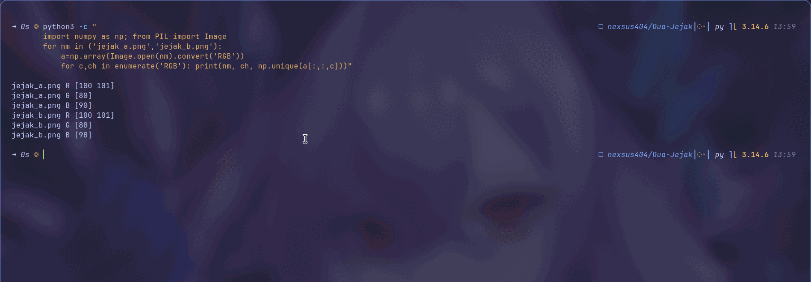
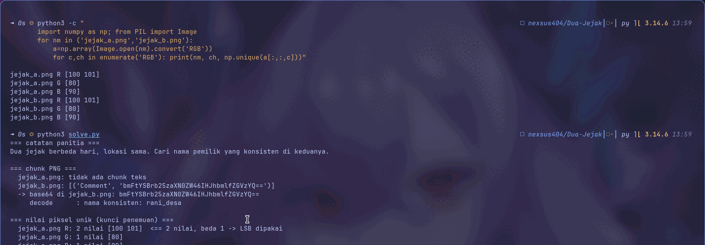

<!-- category: OSINT | points: 464 -->
# Dua Jejak

Kategori: OSINT (Eliminasi), 464 poin waktu saya kerjakan.
Berkas `dua_jejak.zip` dari `techtonicexpo.online/tantangan/39`.

Flag:

```
TechtonicExpoCTF{rani_desa_66394FFC}
```



## Soalnya

> Dua buah foto ditemukan dari dua hari yang berbeda, diduga diambil oleh orang yang sama di lokasi yang
> sama. Kamu diminta mengidentifikasi pemilik jejak berdasarkan konsistensi data.
>
> Berkas: dua foto (jejak_a, jejak_b) dan catatan analisis awal.
>
> Bandingkan kedua foto secara mendalam, termasuk data yang tidak terlihat langsung. Ada nama yang
> konsisten di antara keduanya.
>
> Kunci adalah nama pemilik dalam format tanpa spasi, contoh: `rani_desa`

## Analisis awal

Isi arsipnya:

```bash
unzip -l dua_jejak.zip
```

```
     2949  2026-09-01 12:18   jejak_a.png
       82  2026-09-01 12:18   analisis.txt
     3058  2026-09-01 12:18   jejak_b.png
```

```bash
cat analisis.txt
```

```
Dua jejak berbeda hari, lokasi sama. Cari nama pemilik yang konsisten di keduanya.
```

Kedua PNG-nya 800×600 RGB dan sama-sama cuma ±3 kB. Waktu saya buka, dua-duanya cuma bidang warna rata.
Tidak ada apa pun yang bisa dilihat:

| jejak_a.png | jejak_b.png |
| :---: | :---: |
|  |  |

Sebelum lanjut, ada satu hal yang harus saya sebut karena mempengaruhi seluruh cara saya mengerjakan soal
ini. **Contoh format di deskripsi kebetulan identik dengan jawaban akhirnya.** Artinya siapa pun yang asal
menebak `rani_desa` akan benar tanpa mengerti soalnya. Dan sebaliknya, menemukan string `rani_desa` di
dalam berkas belum membuktikan apa-apa, karena bisa saja itu cuma echo dari contoh tadi. Jadi saya
memutuskan tidak menerima jawaban sampai ada bukti independen dari berkas kedua.



## Prosesnya

**Metadata dulu.**

```bash
exiftool jejak_a.png
exiftool jejak_b.png
```

`jejak_a.png` bersih, cuma field PNG standar. `jejak_b.png` punya satu field tambahan:

```
Comment  : bmFtYSBrb25zaXN0ZW46IHJhbmlfZGVzYQ==
```

Saya konfirmasi di tingkat chunk, bukan cuma percaya exiftool, karena exiftool hanya menampilkan apa yang
dia kenali dan tidak menegaskan apa yang tidak ada:

```
jejak_a.png: IHDR, IDAT, IEND                      -> tidak ada chunk teks
jejak_b.png: IHDR, tEXt(44), IDAT, IEND            -> ada tEXt
```

```bash
echo 'bmFtYSBrb25zaXN0ZW46IHJhbmlfZGVzYQ==' | base64 -d
```

```
nama konsisten: rani_desa
```

Jawabannya sudah muncul di sini. Tapi baru satu sumber, dan persis sama dengan contoh di deskripsi. Belum
cukup buat saya. `jejak_a` harus dibuat bicara juga.

**Mencari data di jejak_a.**

Dugaan pertama saya ukuran IDAT-nya: 2892 byte terasa besar untuk gambar satu warna. Saya uji dengan
membuat pembanding:

```python
Image.fromarray(np.full((600,800,3),(100,80,90),np.uint8)).save('/tmp/polos.png')
```

```
/tmp/polos.png   IDAT = 2734 byte
jejak_a.png      IDAT = 2892 byte     (+158)
jejak_b.png      IDAT = 2945 byte     (+211)
```

Selisihnya cuma sekitar 150–200 byte. Bukan anomali. Dugaan saya salah, dan bagus saya mengujinya, karena
kalau tidak saya akan menulis alasan yang keliru di sini.

Yang benar-benar membongkar justru menghitung nilai piksel unik per channel:

```python
for c, ch in enumerate("RGB"):
    print(ch, np.unique(a[:, :, c]))
```

```
jejak_a.png  R: 2 nilai [100 101]   <== dua nilai, selisih tepat 1
jejak_a.png  G: 1 nilai [80]
jejak_a.png  B: 1 nilai [90]
```

Channel G dan B benar-benar konstan, tapi R punya tepat dua nilai berselisih 1. Itu sidik jari LSB
steganography yang tidak bisa salah: bit terendah channel merah dipakai sebagai kanal data, sementara
mata melihatnya sebagai satu warna rata.



**Membaca payload LSB-nya.**

```python
bits = (a[:, :, 0] & 1).flatten()
data = np.packbits(bits, bitorder="big").tobytes()
pesan = data.split(b"\x7f\x7f\x7f")[0]        # 7f 7f 7f = terminator
```

```
jejak_a.png : 'pemilik: Rani, dari Semarang'
jejak_b.png : 'foto kedua diambil di kota lama Semarang'
```

Sisa aliran bit setelah terminator saya periksa, seluruhnya nol (59.969 dan 59.957 byte), jadi tidak ada
payload lain yang terlewat.

**Menyatukan buktinya.** Nama `Rani` muncul dari berkas yang tidak punya tEXt sama sekali, jadi itu bukti
independen. Kota `Semarang` muncul di kedua foto, persis "lokasi sama" seperti kata `analisis.txt`. Dan
tEXt di `jejak_b` memberi format jawabannya. Ketiganya saling menguatkan, jadi `rani_desa` memang nama
pemiliknya, bukan sekadar echo dari contoh di deskripsi.



## Tools

`unzip`, `exiftool`, `base64` dari coreutils, lalu Python 3.14 dengan NumPy 2.5.1 dan Pillow 12.3.0 untuk
menghitung nilai unik dan mengekstrak LSB. Enumerasi chunk PNG saya tulis manual dengan
`struct.unpack(">I", ...)`. Solver lengkap di [`solve.py`](solve.py).

```
=== chunk PNG ===
  jejak_a.png: tidak ada chunk teks
  jejak_b.png: [('Comment', 'bmFtYSBrb25zaXN0ZW46IHJhbmlfZGVzYQ==')]
     decode      : nama konsisten: rani_desa

=== nilai piksel unik (kunci penemuan) ===
  jejak_a.png R: 2 nilai [100 101]  <== 2 nilai, beda 1 -> LSB dipakai

=== payload LSB channel merah ===
  jejak_a.png: 'pemilik: Rani, dari Semarang'
  jejak_b.png: 'foto kedua diambil di kota lama Semarang'

FLAG : TechtonicExpoCTF{rani_desa_66394FFC}
```

## Yang gagal

`exiftool jejak_a.png` tidak menghasilkan apa-apa. Sempat saya simpulkan berkas itu memang kosong dan
cuma pengisi.

Membuka `jejak_a.png` secara visual juga nihil, cuma warna rata.

Saya sempat berasumsi kedua berkas menyembunyikan dengan cara yang sama. Salah. Cuma `jejak_b` yang punya
tEXt, dan teknik yang sama pada `jejak_a` tidak menghasilkan apa-apa.

Dugaan soal ukuran IDAT yang saya ceritakan di atas: penalaran saya sendiri yang keliru, bukan jalan buntu
soal. "File-nya terasa terlalu besar" itu intuisi yang enak dipercaya tapi tidak pernah saya uji sampai
saya buatkan pembandingnya.

Unpack LSB dengan `bitorder="little"` juga gagal, keluar biner acak `\x0e\xa6\xb6\x966...`. Yang benar
`big`.

Dan yang paling menggoda: berhenti di base64 `jejak_b` sebagai jawaban. Itu tetap dapat poin, tapi tanpa
tahu kenapa, dan tanpa cara membedakannya dari decoy.

Ketiga kegagalan itu, termasuk pembanding PNG satu warna yang membantah dugaan saya sendiri,
bisa direproduksi dengan [`gagal.py`](gagal.py):

```bash
python3 gagal.py
```

## Yang saya ambil dari soal ini

Yang bikin soal ini menarik: penyembunyiannya **asimetris**. Dua berkas yang kelihatan kembar memakai
teknik berbeda, `jejak_b` lewat metadata dan `jejak_a` lewat piksel. Kalau saya cuma menjalankan satu
teknik pemeriksaan pada kedua berkas, separuh soalnya tidak akan terbuka. Dan ironisnya, berkas yang
"bersih" menurut exiftool justru yang menyimpan bukti paling penting, yaitu nama pemiliknya.

Yang mau saya pakai lagi: untuk gambar sintetis, `len(np.unique(kanal))` jauh lebih tajam daripada ukuran
berkas sebagai detektor anomali. Dua nilai berselisih tepat 1 pada satu channel sementara channel lain
konstan itu sidik jari yang tidak mungkin muncul secara alami. Satu baris kode, hasilnya biner: ada atau
tidak ada.

Hal lain yang saya catat: exiftool menjawab "apa yang ada", bukan "apa yang tidak ada". Output bersih
gampang dibaca sebagai "berkas ini kosong", padahal artinya cuma "tidak ada field yang saya kenali".
Enumerasi chunk mentah memberi jawaban yang tegas, dan di soal ini ketiadaan tEXt di `jejak_a` justru
informasi penting karena memaksa pencarian pindah ke ranah piksel.

Yang terbesar buat saya: jawaban yang benar tidak berarti penalaran yang benar. Contoh format di deskripsi
kebetulan sama dengan kuncinya, jadi tebakan buta pun berhasil. Ini kasus bagus untuk membiasakan
konfirmasi silang, satu sumber memberi jawaban dan sumber kedua yang independen memberi keyakinan.

Dan pelajaran dari kesalahan saya sendiri: uji dugaanmu sebelum menulisnya sebagai alasan. Membuat satu PNG
pembanding butuh sepuluh detik, dan itu yang menyelamatkan writeup ini dari memuat penjelasan yang keliru.

<!--
Cek isi minimal panitia:
  1. judul + kategori     -> heading + baris kategori
  2. flag                 -> di atas
  3. analisis awal        -> "Analisis awal"
  4. langkah penyelesaian -> "Prosesnya"
  5. tools / script       -> "Tools" + solve.py
  6. trial-and-error      -> "Yang gagal"
  7. insight / teknik     -> "Yang saya ambil dari soal ini"
-->
