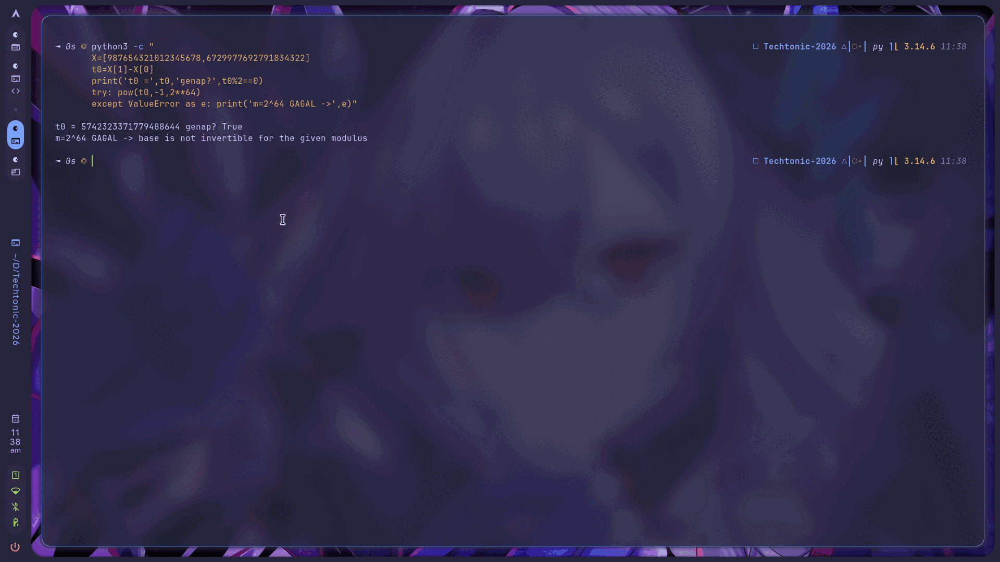
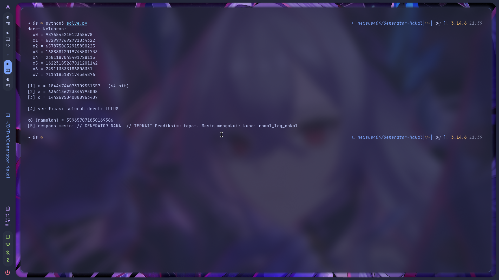
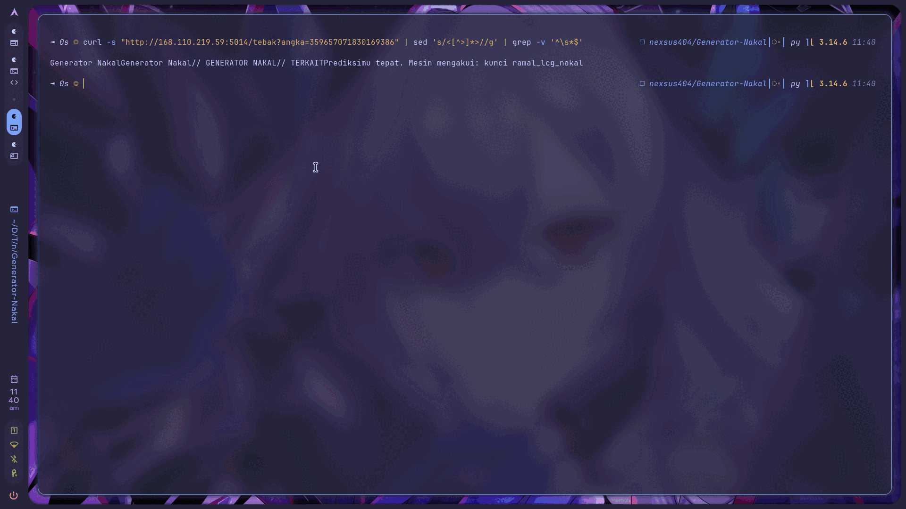

<!-- category: Cryptography | points: 653 -->
# Generator Nakal

Kategori: Cryptography (Eliminasi). Poin 653 waktu saya kerjakan, awalnya 750.
Service: `http://168.110.219.59:5014`, dari halaman `techtonicexpo.online/tantangan/13`.

Flag yang saya dapat:

```
TechtonicExpoCTF{ramal_lcg_nakal_66394FFC}
```


## Isi soalnya

> Mesin ini membangkitkan angka dengan rumus yang kaku. Setiap angka adalah anak dari angka
> sebelumnya. Rumusnya memakai pengali, penambah, dan sisa bagi besar yang semuanya tersembunyi.
> Tapi deret keluarannya bicara lebih banyak dari yang disangka. Dari beberapa angka berurutan,
> semua parameter rahasia bisa dibedah satu per satu. Tebak angka berikutnya dan kirim ke mesin.

Service-nya cuma menampilkan 8 angka dan satu endpoint tebakan:

```
x0 = 987654321012345678      x4 = 2381187045401728115
x1 = 6729977692791834322     x5 = 16223185267011201142
x2 = 6578750652915850225     x6 = 249113833186806331
x3 = 16888812019745501733    x7 = 7114183187174364876

tebak: /tebak?angka=...
```

## Analisis awal

"Pengali, penambah, sisa bagi" itu sudah menyebut tiga parameter LCG tanpa menyebut namanya, jadi rumusnya:

```
x[n+1] = (a · x[n] + c) mod m
```

Ketiganya rahasia. Saya harus memulihkan semuanya cuma dari 8 angka di atas, lalu meramal x8.

Yang bikin saya berhenti sebentar di awal: urutan mengerjakannya. Refleks saya cari `a` duluan karena
itu yang paling terasa "inti". Tapi `a` hidup di aritmetika mod `m`, jadi selama `m` belum ketahuan
tidak ada persamaan yang bisa diselesaikan. Harus `m` dulu, dan `m` kebetulan satu-satunya yang bisa
dicari tanpa tahu dua lainnya. Begitu urutannya kebalik, soalnya jadi buntu total.



## Cara saya memecahkannya

Idenya: hilangkan yang tidak diketahui satu per satu.

**Buang `c` pakai selisih.** Kalau saya ambil selisih dua keluaran berurutan, `c` muncul di kedua suku
dan saling menghapus:

```
t[i]   = x[i+1] − x[i]

t[i+1] = x[i+2] − x[i+1]
       = (a·x[i+1] + c) − (a·x[i] + c)
       = a·(x[i+1] − x[i])
       = a · t[i]     (mod m)
```

Sekarang deret `t` jadi barisan geometrik dengan rasio `a`.

**Buang `a` pakai determinan.** Pada barisan geometrik, tiga suku berurutan selalu memenuhi
`t[i+1]² = t[i+2]·t[i]`. Jadi selisihnya nol:

```
u[i] = t[i+2]·t[i] − t[i+1]²
     = (a²·t[i])·t[i] − (a·t[i])²
     = 0     (mod m)
```

Ini bagian yang menurut saya paling cantik dari soal ini. `u[i] ≡ 0 (mod m)` artinya `m` membagi habis
`u[i]`. Dan `u[i]` bisa saya hitung sebagai bilangan bulat biasa, tanpa modulo, tanpa tahu `a` maupun
`c`. Jadi saya punya beberapa kelipatan `m` di tangan.

**GCD-kan.** Tiap `u[i]` bentuknya `m × k[i]` dengan kofaktor `k[i]` yang acak. GCD dari beberapa `u[i]`
memberi `m` dikali GCD kofaktornya, dan kofaktor acak hampir selalu koprima:

```python
t = [X[i+1] - X[i] for i in range(len(X)-1)]
u = [t[i+2]*t[i] - t[i+1]**2 for i in range(len(t)-2)]
m = abs(reduce(gcd, u))
```

```
m = 18446744073709551557   (64 bit)
```

Sisanya aljabar biasa. Dari `t[1] = a·t[0] (mod m)`:

```python
a = (t[1] * pow(t[0], -1, m)) % m
c = (X[1] - a*X[0]) % m
```

```
a = 6364136223846793005
c = 1442695040888963407
```

Waktu ketiga angka ini keluar saya sempat mengecek ulang karena kelihatan familiar. Ternyata memang:
`a` dan `c` itu konstanta LCG MMIX punya Knuth, dan `m = 2^64 − 59` adalah prima terbesar di bawah 2⁶⁴.
MMIX aslinya pakai `m = 2^64`. Diganti prima di sini malah bikin pemulihan lebih gampang, karena setiap
elemen tak-nol dijamin punya invers.

**Verifikasi sebelum menebak.** Endpoint `/tebak` kemungkinan sekali pakai, jadi saya tidak mau
asal kirim. Parameter saya uji dulu ke ketujuh transisi yang sudah diketahui:

```python
ok = all((a*X[i] + c) % m == X[i+1] for i in range(len(X)-1))
```

```
verifikasi seluruh deret: LULUS
```

Baru setelah itu:

```python
x8 = (a*X[-1] + c) % m      # 359657071830169386
```



```bash
curl -s "http://168.110.219.59:5014/tebak?angka=359657071830169386" | sed 's/<[^>]*>//g'
```

```
// TERKAIT  Prediksimu tepat. Mesin mengakui: kunci ramal_lcg_nakal
```



## Tools

Python 3.14 saja, tanpa dependensi luar. `math.gcd` + `functools.reduce` untuk memulihkan `m`,
`pow(x, -1, m)` untuk inversnya, `urllib` untuk kirim tebakan, `curl` buat recon awal. Semuanya muat
di ~30 baris, ada di [`solve.py`](solve.py).

Satu catatan praktis: `urllib` polos kena HTTP 403 di service Techtonic karena User-Agent difilter.
Saya sudah tahu polanya dari soal Kubah Terbalik sebelumnya, jadi header `User-Agent: curl/8.5.0`
langsung saya pasang dari awal di sini.

```bash
python3 solve.py
```

```
[1] m = 18446744073709551557   (64 bit)
[2] a = 6364136223846793005
[3] c = 1442695040888963407

[4] verifikasi seluruh deret: LULUS

x8 (ramalan) = 359657071830169386
[5] respons mesin: // TERKAIT Prediksimu tepat. Mesin mengakui: kunci ramal_lcg_nakal
```

## Yang gagal sebelum berhasil

**Saya coba asumsikan `m = 2^64`.** Ini tebakan paling wajar, karena itu default di banyak
implementasi LCG. Langsung meledak:

```
ValueError: base is not invertible for the given modulus
```

`t[0]` ternyata genap, jadi tidak punya invers mod 2⁶⁴. Untungnya gagal dengan exception, bukan
diam-diam mengeluarkan `a` dan `c` yang salah. Kalau senyap, saya bisa habis waktu lama.

**Saya sempat mau cari `a` duluan.** Sudah saya singgung di atas: buntu, tidak ada persamaan yang
bisa dipakai tanpa `m`.

**GCD dari satu nilai `u` saja.** Ini yang paling berbahaya. Dengan 4 keluaran saya cuma punya satu
`u`, dan hasilnya:

```
59180836733637035300392479396766569743
```

Kelihatan seperti jawaban. Tidak ada error, tidak ada tanda apa pun kalau itu salah. Ternyata itu
`m × 3208199587805960899`, jadi kelipatan `m`, bukan `m`. Yang membongkarnya cuma dua hal: panjang
bitnya 126 bit padahal generatornya jelas 64-bit, dan verifikasi ke seluruh deret di langkah
sebelum menebak.

Setelah saya ulang dengan 5 keluaran (2 nilai `u`), GCD-nya langsung tepat `18446744073709551557`.
Saya tetap pakai semua 8 keluaran di solver final, karena tiap `u` tambahan memperkecil peluang ada
faktor asing yang ikut terbawa.

Ringkasnya:

| Jumlah keluaran dipakai | Hasil GCD |
| :-- | :--- |
| 4 (1 nilai u) | kelipatan m, salah |
| 5 (2 nilai u) | tepat m |
| 8 (5 nilai u) | tepat m, paling aman |

## Yang saya ambil dari soal ini

Yang bikin serangan ini jalan bukan trik tunggal, tapi urutan mengupasnya: selisih menghilangkan `c`,
determinan menghilangkan `a`, dan yang tersisa murni kelipatan `m`. Tiga parameter rahasia terdengar
mustahil, padahal cuma perlu dikupas berlapis.

Pola "bangun beberapa bilangan yang dijamin kelipatan rahasia, lalu GCD-kan" ternyata jauh lebih umum
dari LCG. Syaratnya cuma satu: bilangan-bilangan itu tidak boleh berbagi faktor lain. Konsekuensinya,
**jumlah sampel itu parameter keamanan buat penyerang** — 4 keluaran memberi jawaban salah yang
meyakinkan, 5 keluaran memberi jawaban benar. Ini yang paling saya ingat dari soal ini.

Pelajaran lain yang lebih umum: hasil yang "kelihatan wajar" harus dicek dimensinya. GCD di percobaan
gagal tadi memberi bilangan 127-bit untuk generator 64-bit. Ketidakcocokan ukuran itu sinyal paling
awal bahwa saya salah, jauh sebelum verifikasi formal.

Dan soal LCG-nya sendiri: menyembunyikan `a`, `c`, `m` sama sekali bukan pengamanan. Yang dibeli cuma
beberapa keluaran tambahan yang harus dilihat penyerang. Kalau memang butuh acak untuk keperluan
keamanan, `secrets` atau `os.urandom`, bukan LCG.

<!--
Cek isi minimal panitia:
  1. judul + kategori     -> heading + baris kategori di atas
  2. flag                 -> di atas, tepat di bawah info soal
  3. analisis awal        -> bagian "Analisis awal"
  4. langkah penyelesaian -> bagian "Cara saya memecahkannya"
  5. tools / script       -> bagian "Tools" + solve.py
  6. trial-and-error      -> bagian "Yang gagal sebelum berhasil"
  7. insight / teknik     -> bagian "Yang saya ambil dari soal ini"
-->
