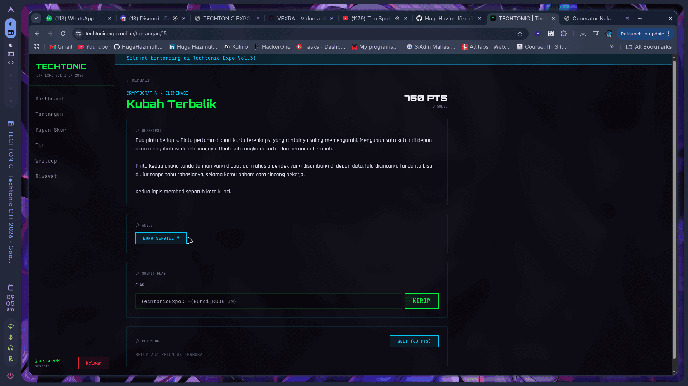
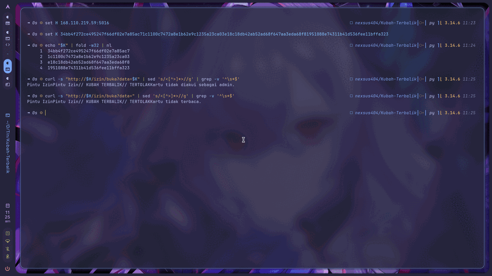
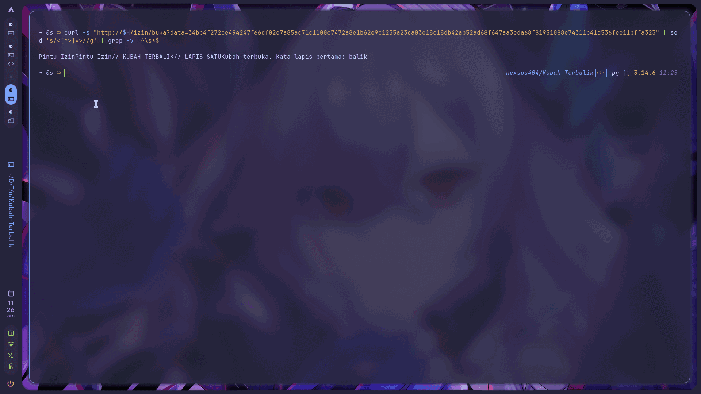
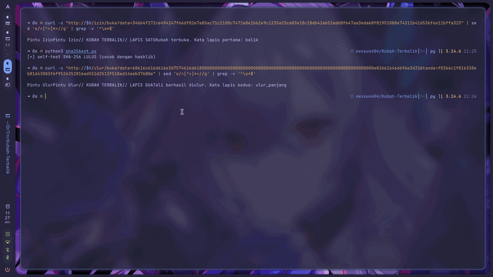

<!-- category: Cryptography | points: 750 -->
# Kubah Terbalik

Kategori: Cryptography (Eliminasi), 750 poin, 0 solve waktu saya buka.
Service `http://168.110.219.59:5016`, dari `techtonicexpo.online/tantangan/15`.

Flag:

```
TechtonicExpoCTF{balik_ulur_panjang_66394FFC}
```



## Soalnya

> Dua pintu berlapis. Pintu pertama dikunci kartu terenkripsi yang rantainya saling memengaruhi.
> Mengubah satu kotak di depan akan mengubah isi di belakangnya. Ubah satu angka di kartu, dan peranmu berubah.
>
> Pintu kedua dijaga tanda tangan yang dibuat dari rahasia pendek yang disambung di depan data, lalu dicincang.
> Tanda itu bisa diulur tanpa tahu rahasianya, selama kamu paham cara cincang bekerja.
>
> Kedua lapis memberi separuh kata kunci.

## Analisis awal

Dua endpoint terpisah, masing-masing satu serangan kripto klasik, dan deskripsinya menyebut nama
serangannya secara tersamar.

"Rantainya saling memengaruhi" dan "mengubah satu kotak di depan akan mengubah isi di belakangnya" itu
CBC. Kalau CBC dan bisa dimodifikasi, artinya bit-flipping. "Rahasia pendek yang disambung **di depan**
data, lalu dicincang" itu `SHA256(rahasia ‖ data)`, dan "tanda itu bisa diulur tanpa tahu rahasianya"
mengonfirmasi length extension.

Bahan yang saya dapat dari kedua halaman:

```
/izin  kartu : 34bb4f272ce495247f66df02e7a85ac71c1100c7472a8e1b62e9c1235a23ca03
               e18c18db42ab52ad68f647aa3eda68f81951088e74311b41d536fee11bffa323
/ulur  data  : halaman=utama
       tanda : 0be8eb5f8bc38356bbf06ad423ccf71581991159ccf49b133d7f50be0d72431e
```

Kartunya saya potong per 16 byte:

```
1  34bb4f272ce495247f66df02e7a85ac7
2  1c1100c7472a8e1b62e9c1235a23ca03
3  e18c18db42ab52ad68f647aa3eda68f8
4  1951088e74311b41d536fee11bffa323
```

64 byte, 4 blok AES. Blok pertama kemungkinan IV.



## Lapis satu: CBC bit-flipping

Sebelum menyerang, saya petakan dulu respons servernya. Saya kirim kartu asli, kartu kosong, dan kartu
satu blok:

```
asli    -> TERTOLAK  Kartu tidak diakui sebagai admin.
kosong  -> TERTOLAK  Kartu tidak terbaca.
1 blok  -> TERTOLAK  Kartu tidak terbaca.
```

Dua pesan berbeda, jadi saya punya oracle. Ternyata "tidak terbaca" cuma muncul untuk masalah panjang,
sedangkan "tidak diakui sebagai admin" berarti kartunya berhasil didekripsi dan di-parse. Saya konfirmasi
dengan membalik tiap byte IV satu per satu: semuanya tetap "tidak diakui", tidak ada yang jadi "tidak
terbaca". Berarti parsernya longgar, dan bit-flipping saya tidak akan tersandung validasi struktur.

Pada CBC, dekripsi blok ke-i adalah `P[i] = D(C[i]) XOR C[i-1]`. Karena `C[-1]` itu IV, mengubah IV byte
ke-j akan membalik plaintext blok-0 byte ke-j dengan delta yang persis sama, tanpa merusak blok lain.
Itulah "mengubah satu kotak di depan akan mengubah isi di belakangnya".

Bagian yang menghemat banyak waktu buat saya: petunjuk "ubah satu **angka**" saya baca harfiah. Kalau
targetnya digit ASCII, mengubah `'0'` (0x30) jadi `'1'` (0x31) cukup XOR dengan 0x01. Posisinya belum
tahu, tapi cuma ada 48 kemungkinan. Jadi saya sapu semua:

```python
for p in range(48):
    m = bytearray(KARTU); m[p] ^= 0x01
    kirim(bytes(m))
```

Kena di posisi 6, percobaan ketujuh:

```
posisi  6 -> HIT: // LAPIS SATU  Kubah terbuka. Kata lapis pertama: balik
```

Posisi 6 langsung masuk akal begitu dipetakan ke plaintext. Blok 0 isinya `admin=0&...`:

```
index :  0  1  2  3  4  5  6
byte  :  a  d  m  i  n  =  0     <- XOR 0x01 -> '1'
```

Kata pertama: `balik`.



## Lapis dua: SHA-256 length extension

Saya kirim pasangan aslinya dulu untuk memastikan jalur verifikasinya benar:

```bash
curl -s "http://$H/ulur/buka?data=$(printf 'halaman=utama' | xxd -p)&tanda=0be8eb5f...431e"
```

```
DITERIMA  Tanda sah, tapi tidak ada perintah khusus di dalam data.
```

Bagus. Tanda tangannya valid, tinggal butuh perintah di dalam data. Karena lapis satu memakai `admin=1`,
saya coba yang sama di sini.

SHA-256 itu konstruksi Merkle-Damgård, jadi digest akhirnya sebenarnya adalah state internal setelah blok
terakhir. Digest yang saya punya bisa dipakai sebagai titik awal untuk melanjutkan hashing data tambahan,
tanpa pernah tahu rahasianya. Yang perlu ditebak cuma panjang rahasianya, karena itu menentukan padding
yang harus disisipkan.

`hashpump` tidak ada di mesin saya, jadi saya tulis ulang SHA-256 dengan state yang bisa di-set
([`sha256ext.py`](sha256ext.py)). Sebelum dipakai menyerang, saya verifikasi dulu ke `hashlib`:

```python
for t in [b"", b"abc", b"halaman=utama", b"x"*200]:
    assert sha256(t).hex() == hashlib.sha256(t).hexdigest()
```

```
[+] self-test SHA-256 LULUS (cocok dengan hashlib)
```

Ini penting. Menulis SHA-256 sendiri itu rawan salah ketik di tabel K atau urutan rotasi, dan bug diam-diam
akan terlihat identik dengan "panjang rahasia tidak ketemu" setelah 64 percobaan. Tiga baris assert
menghilangkan seluruh keraguan itu.

Serangannya, untuk tiap tebakan panjang rahasia:

```python
L      = slen + len(DATA)
glue   = md_pad(L)
palsu  = DATA + glue + b"&admin=1"
tanda  = sha256(b"&admin=1", state=bytes.fromhex(SIG), prelen=L + len(glue)).hex()
```

```
[&admin=1] panjang rahasia = 16 -> HIT
// LAPIS DUA  Tali berhasil diulur. Kata lapis kedua: ulur_panjang
```



`balik` + `ulur_panjang` jadi `balik_ulur_panjang`.

## Tools

`curl` dan `xxd` untuk recon, Python 3.14 dengan `urllib` stdlib untuk otomasi, `hashlib` sebagai
pembanding self-test, dan SHA-256 custom di [`sha256ext.py`](sha256ext.py). Solver lengkap di
[`solve.py`](solve.py), jalan dengan `python3 solve.py`.

Tanpa dependensi luar sama sekali.

```
[LAPIS 1] IV[6] ^= 0x01  ('0' -> '1')
          // LAPIS SATU Kubah terbuka. Kata lapis pertama: balik

[LAPIS 2] panjang rahasia = 16 byte, sambung '&admin=1'
          // LAPIS DUA Tali berhasil diulur. Kata lapis kedua: ulur_panjang
```

## Yang gagal

Kirim kartu asli apa adanya: ditolak, memang harus dimodifikasi. Wajar.

Cari komentar atau hint di HTML kedua halaman: nihil, bersih.

Rusak byte terakhir kartu berharap bocor error padding: tetap "tidak diakui". Server tidak memberi padding
oracle.

Balik 0xFF tiap byte IV berharap ada yang merusak parsing supaya saya bisa memetakan struktur plaintext:
16 dari 16 tetap "tidak diakui". Gagal sebagai metode pemetaan, tapi tidak sia-sia, karena justru
membuktikan parsernya longgar.

Yang bikin saya berhenti agak lama: script Python pertama saya pakai `urllib` polos dan langsung kena
`HTTP 403 FORBIDDEN`. Sempat saya kira serangannya yang ditolak. Ternyata cuma server memfilter User-Agent,
dan ketahuan karena `curl` sudah lebih dulu berhasil untuk URL yang sama. Cukup pasang
`User-Agent: curl/8.5.0`.

Yang paling bodoh, dan ini bug saya sendiri: di length extension saya menulis filter respons yang mencari
string `"tidak sah"`. Pesan servernya ternyata `Tanda tidak cocok`. Akibatnya script saya lapor **HIT** di
`slen=1` padahal body responsnya `[403] DITOLAK`. False positive murni karena saya menegasikan pola gagal,
bukan mencocokkan pola sukses. Setelah klasifikasinya dibetulkan, panjang rahasia 16 langsung ketemu.

Ketiga kegagalan itu bisa direproduksi dengan [`gagal.py`](gagal.py), termasuk bukti bahwa pesan
servernya memang `Tanda tidak cocok` dan bukan `tidak sah` seperti yang dicari filter saya:

```bash
python3 gagal.py
```

## Yang saya ambil dari soal ini

Dua serangan di soal ini sama-sama menyerang **integritas**, bukan kerahasiaan. Saya tidak pernah memecahkan
kunci AES maupun rahasia HMAC-nya. CBC tanpa MAC membiarkan ciphertext dimodifikasi secara terarah, dan
`SHA256(rahasia ‖ data)` membiarkan pesan diperpanjang. Keduanya kegagalan otentikasi, dan keduanya lenyap
kalau pakai HMAC atau AES-GCM.

Yang paling menghemat waktu: membaca petunjuk deskripsi secara harfiah. "Ubah satu **angka**" memangkas ruang
pencarian dari 48 posisi × 256 delta (12.288 permintaan) jadi 48 posisi × 1 delta, karena `'0' XOR '1' = 0x01`.
Ketemu di percobaan ke-7. Saya tidak perlu menebak isi plaintext sama sekali, cukup menebak *bentuk* targetnya.

Hal kecil yang ternyata penting: bedakan "tidak valid" dari "valid tapi kurang". Respons `Tanda sah, tapi
tidak ada perintah khusus` memastikan jalur verifikasi lapis dua sudah benar sebelum satu pun serangan
dijalankan. Tanpa itu, kegagalan length extension jadi ambigu, salah panjang rahasia atau salah perintah.

Dan pelajaran dari bug saya sendiri: klasifikasi respons itu bagian dari eksploit, bukan sekadar logging.
Filter yang ditulis asal bisa menyembunyikan hasil yang benar, atau lebih buruk, melaporkan sukses palsu.

<!--
Cek isi minimal panitia:
  1. judul + kategori     -> heading + baris kategori
  2. flag                 -> di atas
  3. analisis awal        -> "Analisis awal"
  4. langkah penyelesaian -> "Lapis satu" + "Lapis dua"
  5. tools / script       -> "Tools" + solve.py + sha256ext.py
  6. trial-and-error      -> "Yang gagal"
  7. insight / teknik     -> "Yang saya ambil dari soal ini"
-->
