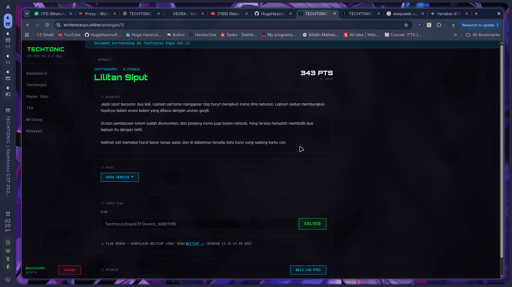
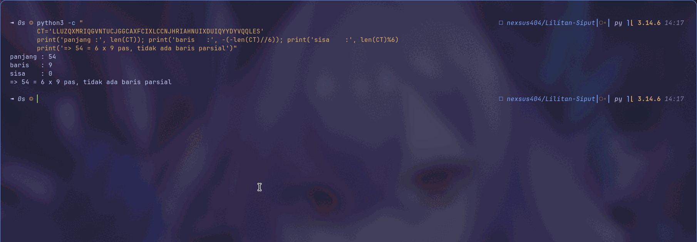
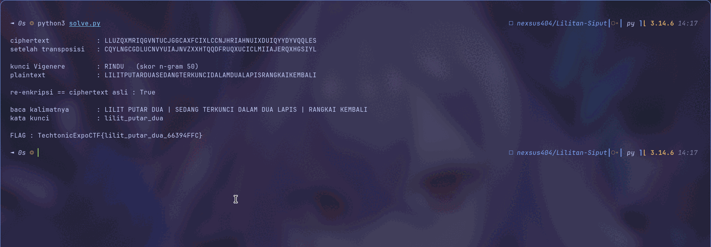
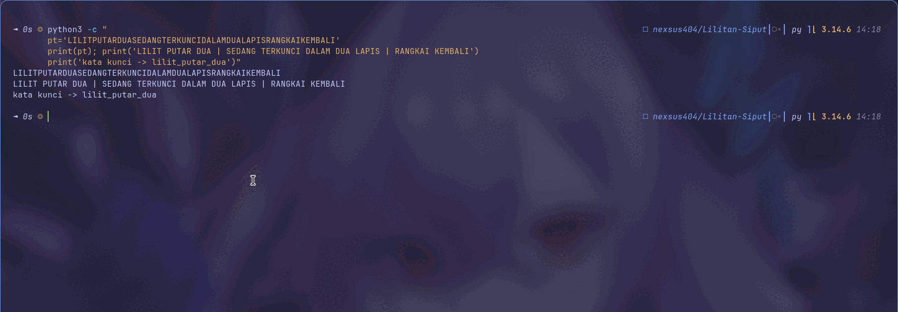

<!-- category: Cryptography | points: 500 -->
# Lilitan Siput

Kategori: Cryptography (Eliminasi), 500 poin waktu saya kerjakan.
Service `http://168.110.219.59:5013`, dari `techtonicexpo.online/tantangan/12`.

Flag:

```
TechtonicExpoCTF{lilit_putar_dua_66394FFC}
```



## Soalnya

> Jejak siput berputar dua kali. Lapisan pertama menggeser tiap huruf mengikuti irama lima ketukan.
> Lapisan kedua membungkus hasilnya dalam enam kolom yang dibaca dengan urutan ganjil.
>
> Urutan pembacaan kolom sudah diumumkan, dan panjang irama juga bukan rahasia. Yang tersisa hanyalah
> membalik dua lapisan itu dengan teliti.
>
> Kalimat asli memakai huruf besar tanpa spasi, dan di dalamnya terselip kata kunci yang sedang kamu cari.

Yang saya dapat dari service:

```
jejak  : LLUZQXMRIQGVNTUCJGGCAXFCIXLCCNJHRIAHNUIXDUIQYYDYVQQLES
catatan: Irama vigenere memakai kata sandi lima huruf.
         Enam kolom dibaca dengan urutan: 3-1-5-0-4-2.
```

## Analisis awal

Dua lapis bertumpuk. Lapis dalam Vigenère dengan kunci 5 huruf (rahasia), lapis luar transposisi kolom 6
dengan urutan baca `3-1-5-0-4-2` (sudah diumumkan).

Karena enkripsinya berjalan plaintext → Vigenère → transposisi, dekripsi harus dari luar ke dalam. Bongkar
transposisi dulu, baru serang Vigenère. Urutan ini wajib. Selama huruf-hurufnya masih teracak posisinya,
tiap alat statistik yang mengandalkan posisi (coset Vigenère, indeks koinsidensi, chi-square) akan
mengukur data yang salah.

Saya cek ukuran gridnya dulu:

```python
print('panjang :', len(CT))          # 54
print('baris   :', -(-54//6))        # 9
print('sisa    :', 54 % 6)           # 0
```

54 = 6 × 9 pas, tanpa baris parsial. Ini menyederhanakan banyak hal: keenam kolom sama panjang 9 huruf,
jadi ciphertext tinggal dipotong rata enam.



## Prosesnya

**Balik transposisinya.** Enkripsinya menulis teks baris demi baris ke grid 6 kolom, lalu membaca kolom
sesuai urutan `3-1-5-0-4-2`. Jadi:

```
ciphertext = kolom[3] ++ kolom[1] ++ kolom[5] ++ kolom[0] ++ kolom[4] ++ kolom[2]
```

Membaliknya berarti memotong ciphertext jadi enam blok 9 huruf, mengembalikan tiap blok ke nomor kolomnya,
lalu membaca grid per baris:

```python
kol = {}
for i, c in enumerate([3,1,5,0,4,2]):
    kol[c] = CT[i*9:(i+1)*9]
mid = "".join(kol[c][r] for r in range(9) for c in range(6))
```

```
CQYLNGCGDLUCNVYUIAJNVZXXHTQQDFRUQXUCICLMIIAJERQXHGSIYL
```

Ada satu ambiguitas yang sempat saya khawatirkan. Kalimat "urutan baca" bisa ditafsirkan dua cara: blok
ke-i adalah kolom `order[i]`, atau kolom c dibaca di posisi `order[c]`. Saya uji dua-duanya, hasilnya
identik. Ternyata permutasi `[3,1,5,0,4,2]` kebetulan involusi, pasangannya sendiri. Jadi ambiguitas itu
tidak perlu diperdebatkan.

**Pecahkan Vigenère-nya.** Panjang kunci sudah diketahui (5), jadi teks saya pecah jadi 5 coset. Huruf
ke-0, 5, 10, dan seterusnya dikunci geseran yang sama, begitu pula coset lainnya. Tiap coset otomatis jadi
sandi Caesar biasa.

Masalahnya tiap coset cuma berisi sekitar 11 huruf, terlalu pendek untuk chi-square sendirian. Jadi saya
pakai dua tahap. Pertama, per coset, saya peringkat 26 geseran dengan chi-square terhadap frekuensi huruf
bahasa Indonesia lalu ambil 4 teratas. Kedua, saya adu semua kombinasinya (4⁵ = 1024 kandidat kunci) dan
skor tiap plaintext utuh dengan hitungan n-gram Indonesia (`YANG`, `KUNCI`, `DAN`, `NG`, `AN`, dan
seterusnya).

```python
for i in range(5):
    coset = mid[i::5]
    urut  = sorted(range(26), key=lambda s: chi(geser(coset, s)))
    kandidat.append(urut[:4])
best = max((skor(pt), key, pt) for combo in itertools.product(*kandidat))
```

```
kunci Vigenere : RINDU   (skor n-gram 50)
plaintext      : LILITPUTARDUASEDANGTERKUNCIDALAMDUALAPISRANGKAIKEMBALI
```

Pemenangnya menang telak. Kandidat kedua cuma berskor 45 dan hasilnya jelas sampah
(`SILIPWUTANKUASAKANGPLRKUJJIDAHHM...`).



**Verifikasi.** Tidak ada endpoint verifikasi di service, jadi satu-satunya oracle saya adalah round-trip.
Plaintext saya enkripsi ulang melalui kedua lapis, hasilnya harus identik dengan ciphertext asli:

```python
v     = vigenere_encrypt(pt, "RINDU")
kol   = ["".join(v[r*6 + c] for r in range(9)) for c in range(6)]
ulang = "".join(kol[c] for c in [3,1,5,0,4,2])
assert ulang == CT
```

```
re-enkripsi     : LLUZQXMRIQGVNTUCJGGCAXFCIXLCCNJHRIAHNUIXDUIQYYDYVQQLES
ciphertext asli : LLUZQXMRIQGVNTUCJGGCAXFCIXLCCNJHRIAHNUIXDUIQYYDYVQQLES
COCOK PERSIS    : True
```

Cocok byte demi byte. Baru di titik ini saya yakin, bukan sekadar "kelihatan bahasa Indonesia".

**Ambil kata kuncinya.** Plaintext-nya saya penggal:

```
LILIT PUTAR DUA | SEDANG TERKUNCI DALAM DUA LAPIS | RANGKAI KEMBALI
```

Subjek kalimatnya, hal yang "sedang terkunci dalam dua lapis", adalah LILIT PUTAR DUA. Itu kata kunci yang
dimaksud deskripsi, dan bentuknya konsisten dengan kunci soal-soal lain di event ini
(`lsb_tersembunyi`, `kembar_terkait`, `ramal_lcg_nakal`): frasa nomina huruf kecil dipisah garis bawah.



## Tools

Python 3.14, `itertools.product` untuk mengadu 1024 kombinasi, `curl` untuk mengambil jejak dari service.
Tanpa dependensi luar, tanpa `pycipher` atau toolkit kriptanalisis apa pun. Chi-square dan skor n-gram saya
tulis manual sekitar 10 baris di [`solve.py`](solve.py).

```
ciphertext            : LLUZQXMRIQGVNTUCJGGCAXFCIXLCCNJHRIAHNUIXDUIQYYDYVQQLES
setelah transposisi   : CQYLNGCGDLUCNVYUIAJNVZXXHTQQDFRUQXUCICLMIIAJERQXHGSIYL

kunci Vigenere        : RINDU   (skor n-gram 50)
plaintext             : LILITPUTARDUASEDANGTERKUNCIDALAMDUALAPISRANGKAIKEMBALI

re-enkripsi == ciphertext asli : True

kata kunci            : lilit_putar_dua
```

## Yang gagal

Saya buang waktu paling banyak di awal, menebak kunci dari tema soal. Judulnya berteriak "SIPUT" dan
"LILIT", jadi naluri pertama saya menebak dari situ:

```
SIPUT -> KIJRUOURJSCUYBFCALPUDRIDOBIBJMZM...   sampah
LILIT -> RINDUVUVVSJUCNFJAPBUKRMPOIIFVMGM...   sampah
JEJAK -> TMPLDXYXDBLYEVOLERJDMVOXXKMHDVIQ...   sampah
IRAMA -> UZYZNYLGRLMLNJYMRAXNNIXLHLZQRFJD...   sampah
```

Ada kebetulan yang lucu di percobaan `LILIT`: lima huruf pertama hasilnya justru `RINDU`, yang ternyata
memang kuncinya. Saya tidak menyadarinya waktu itu dan lanjut menebak dua kali lagi.

Kunci sebenarnya `RINDU`, tidak ada hubungannya sama sekali dengan tema soal. Menebak kunci tematik memakan
waktu lebih lama daripada langsung menulis pemecah frekuensi, yang toh cuma sekitar 20 baris.

Saya juga sempat mencoba konvensi transposisi alternatif (grid dibalik, baca kolom-lalu-baris). Hasilnya
`mid` jadi `CCNJHRIAHQGVNTUCJGYDYVQQLESLLUZ...` dan skor n-gram terbaiknya cuma 17 melawan 50 pada konvensi
yang benar. Gagal, tapi berguna sebagai kontrol.

Satu hal lagi yang hampir bikin saya salah: chi-square per coset kalau cuma diambil geseran terbaiknya saja
ternyata rapuh. Coset 11 huruf terlalu pendek, peringkat teratas belum tentu benar. Harus top-4 lalu diadu
kombinasinya.

## Yang saya ambil dari soal ini

Sandi berlapis harus dibongkar dari lapis terluar. Kalau urutannya dibalik, soalnya terasa mustahil padahal
parameternya sudah setengah diumumkan. Ini yang paling mudah keliru.

Yang menurut saya paling berguna: chi-square untuk **menyaring**, n-gram untuk **memutuskan**. Coset 11
huruf terlalu pendek untuk dipercayai sendirian, tapi cukup andal untuk menyempitkan 26 geseran jadi 4
kandidat. Ruang pencarian runtuh dari 26⁵ = 11.881.376 jadi 4⁵ = 1.024, cukup kecil untuk diadu satu per
satu dengan skor n-gram atas teks utuh, yang jauh lebih kuat karena melihat seluruh 54 huruf sekaligus
bukan cuma 11.

Efek samping yang tidak saya duga: skor n-gram ternyata juga bisa dipakai memilih konvensi transposisi,
bukan cuma memilih kunci. Ambiguitas "urutan baca kolom" biasanya diselesaikan dengan menebak lalu melihat.
Dengan menjalankan pemecah Vigenère penuh untuk tiap konvensi lalu membandingkan skor akhirnya (50 vs 17),
pilihan konvensi jadi keputusan terukur, bukan firasat.

Dan yang paling praktis: untuk soal tanpa oracle, round-trip adalah oracle-nya. Empat baris kode mengubah
"kelihatannya benar" jadi bukti.

<!--
Cek isi minimal panitia:
  1. judul + kategori     -> heading + baris kategori
  2. flag                 -> di atas
  3. analisis awal        -> "Analisis awal"
  4. langkah penyelesaian -> "Prosesnya"
  5. tools / script       -> "Tools" + solve.py
  6. trial-and-error      -> "Yang gagal"
  7. insight / teknik     -> "Yang saya ambil dari soal ini"
-->
