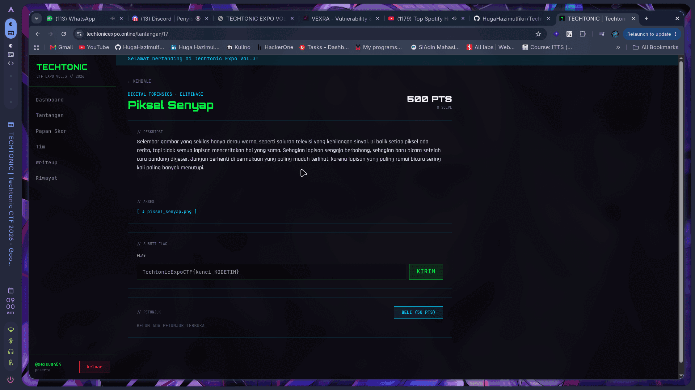
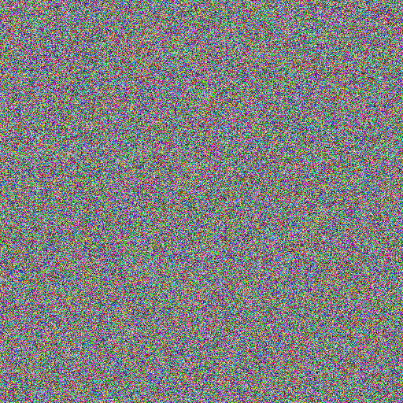
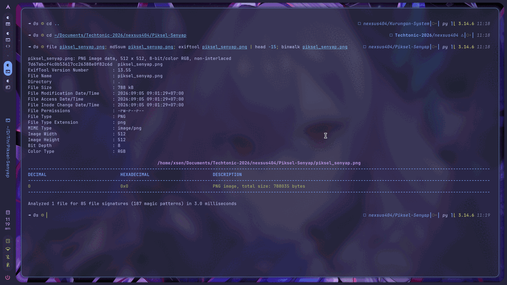
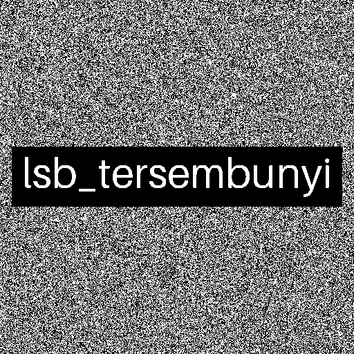
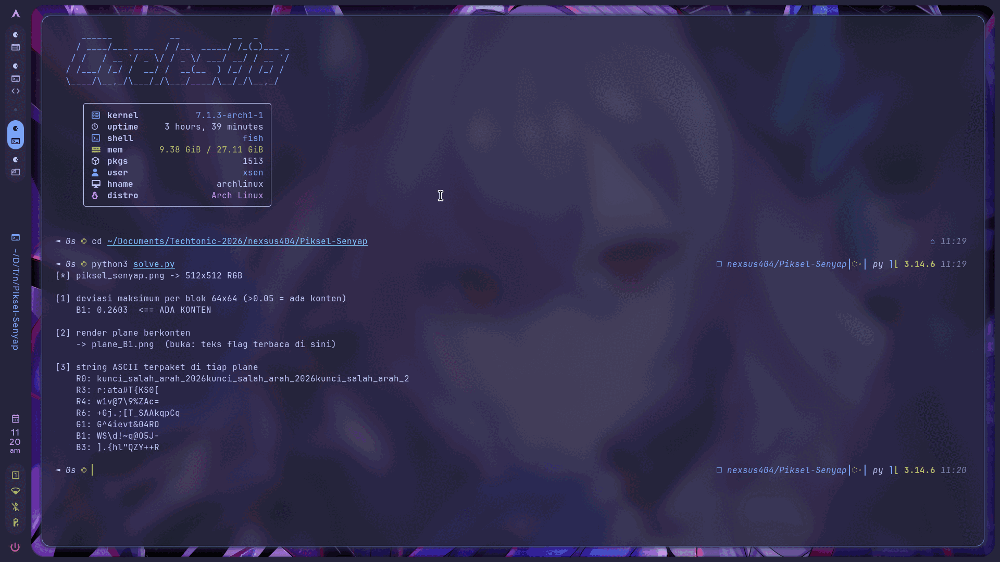

<!-- category: Digital Forensics | points: 500 -->
# Piksel Senyap

Kategori: Digital Forensics (Eliminasi), 500 poin. Soal pertama yang saya kerjakan hari itu, masih 0 solve waktu saya buka.
Berkas: `piksel_senyap.png` dari `techtonicexpo.online/tantangan/17`.

Flag:

```
TechtonicExpoCTF{lsb_tersembunyi_66394FFC}
```



## Deskripsi dari panitia

> Selembar gambar yang sekilas hanya derau warna, seperti saluran televisi yang kehilangan sinyal.
> Di balik setiap piksel ada cerita, tapi tidak semua lapisan menceritakan hal yang sama. Sebagian
> lapisan sengaja berbohong, sebagian baru bicara setelah cara pandang digeser. Jangan berhenti di
> permukaan yang paling mudah terlihat, karena lapisan yang paling ramai bicara sering kali paling
> banyak menutupi.

## Membaca deskripsinya dulu

Deskripsi soal ini sebenarnya sudah memberi peta lengkap kalau dibaca sebagai istilah teknis, bukan puisi.
"Lapisan" itu bit-plane. "Sebagian lapisan sengaja berbohong" berarti ada plane umpan. "Baru bicara setelah
cara pandang digeser" berarti datanya digeser dari bit 0 ke bit lain. Dan "jangan berhenti di permukaan yang
paling mudah terlihat" jelas-jelas menyuruh saya tidak berhenti di LSB.

Jadi rencananya bukan "ekstrak LSB" seperti biasa, tapi audit ke-24 bit-plane satu per satu (3 channel × 8 bit).

Recon dasar dulu supaya tidak ada jalur murah yang terlewat:

```bash
file piksel_senyap.png
md5sum piksel_senyap.png
exiftool piksel_senyap.png
binwalk piksel_senyap.png
```

```
piksel_senyap.png: PNG image data, 512 x 512, 8-bit/color RGB, non-interlaced
7d67abcf4c0b53617cc26388e0f82c6d  piksel_senyap.png

DECIMAL   HEXADECIMAL   DESCRIPTION
0         0x0           PNG image, total size: 788035 bytes
```

Ini wujud berkasnya. Benar-benar cuma derau, tidak ada apa pun yang bisa dilihat mata:



Tidak ada metadata mencurigakan, tidak ada file ter-append. Satu hal yang saya perhatikan: raw pixel
512×512×3 = 786.432 byte, sedangkan PNG-nya 788.035 byte. Hasil kompresi Deflate malah lebih besar dari
data mentahnya, artinya isi gambar benar-benar acak. Konsisten dengan "derau warna", dan menegaskan
datanya memang di dalam nilai piksel, bukan di tempat lain.



## Prosesnya

Kunci soal ini menurut saya ada di satu sifat noise: pada citra acak murni, setiap bit-plane punya rasio
bit-1 sekitar 0,5 dan merata di seluruh area. Kalau ada plane yang menyimpang, di situlah datanya. Jadi
saya tidak perlu menebak plane mana, tinggal ukur semuanya.

```python
for c in range(3):
    for b in range(8):
        p = (a[:, :, c] >> b) & 1
        print(CH[c], b, f"{p.mean():.4f}")
```

```
R  0   0.5002      G  0   0.5001      B  0   0.4992
R  1   0.5001      G  1   0.5019      B  1   0.4409   <== ini
R  2   0.4984      G  2   0.5013      B  2   0.5003
...23 plane lainnya rapat di 0.498 - 0.502...
```

Blue channel bit 1 rasionya 0,4409 sementara sisanya menempel di 0,50. Persis "baru bicara setelah cara
pandang digeser": datanya di bit 1, bukan bit 0.

Rasio global saja belum cukup, saya perlu tahu sebarannya. Saya bikin peta rasio per blok 64×64:

```
0.51 0.51 0.50 0.49 0.50 0.50 0.50 0.49
0.50 0.51 0.49 0.49 0.51 0.50 0.50 0.51
0.49 0.50 0.49 0.50 0.50 0.50 0.49 0.50
0.32 0.24 0.26 0.27 0.28 0.26 0.26 0.31
0.29 0.27 0.25 0.26 0.24 0.26 0.25 0.30
0.49 0.50 0.49 0.50 0.50 0.50 0.49 0.50
0.50 0.50 0.49 0.48 0.52 0.49 0.50 0.50
0.50 0.49 0.50 0.51 0.51 0.49 0.49 0.49
```

Penyimpangannya terkumpul di pita horizontal y = 192–320, melebar penuh. Bentuk kotak begini khas teks
yang digambar, bukan byte yang di-encode. Di titik ini saya seharusnya langsung render jadi gambar, tapi
tidak (lihat bagian kegagalan di bawah).

Begitu di-render:

```python
p = (((a[:, :, 2] >> 1) & 1) * 255).astype(np.uint8)
Image.fromarray(p).save("plane_B1.png")
```

Teksnya langsung terbaca di tengah noise:



Isinya `lsb_tersembunyi`. Bandingkan dengan gambar aslinya di atas: piksel yang sama persis, cuma
dilihat dari bit yang berbeda.

Tapi deskripsi menyebut ada lapisan yang "sengaja berbohong", jadi saya tidak mau submit sebelum mengecek
sisanya. Masalahnya, uji bias tadi cuma menangkap konten visual. Teks yang di-pack jadi byte akan tetap
terlihat seperti noise. Jadi saya unpack ke-24 plane jadi ASCII:

```python
bits = ((a[:, :, c] >> b) & 1).flatten()
data = np.packbits(bits, bitorder="big").tobytes()
re.findall(rb"[ -~]{12,}", data)
```

```
R0: kunci_salah_arah_2026kunci_salah_arah_2026kunci_salah_arah_2...
```

Umpannya ada di Red channel LSB, tempat pertama yang dicek semua orang. Diulang 20 kali di 420 byte pertama,
sisanya noise. Ditaruh persis di awal supaya langsung kena begitu ada yang jalankan ekstraksi LSB standar.

Hasil audit lengkapnya: R bit 0 berisi umpan, B bit 1 berisi payload asli, 22 plane sisanya noise murni.



## Tools

`file`, `md5sum`, `exiftool`, `binwalk` untuk recon. Sisanya Python dengan NumPy 2.5.1 dan Pillow 12.3.0.

`zsteg`, yang sebenarnya tool standar untuk kasus begini, tidak ada di mesin saya. Awalnya kesal, tapi
akhirnya malah menguntungkan: uji bias per blok bukan fitur bawaan `zsteg`, dan justru itu yang langsung
menunjuk plane B1 tanpa saya perlu memelototi 24 gambar satu per satu.

Solvernya di [`solve.py`](solve.py), jalankan dengan `python3 solve.py`.

```
[1] deviasi maksimum per blok 64x64 (>0.05 = ada konten)
    B1: 0.2603  <== ADA KONTEN

[2] render plane berkonten
    -> plane_B1.png

[3] string ASCII terpaket di tiap plane
    R0: kunci_salah_arah_2026kunci_salah_arah_2026kunci_salah_arah_2
```

## Yang gagal

`exiftool` dan `binwalk` dua-duanya nihil di awal. Bukan masalah besar, tapi memakan waktu.

`zsteg` tidak terinstall, jadi saya harus menulis scanner NumPy sendiri. Ini yang bikin start-nya lambat.

Yang paling memalukan: setelah menemukan plane B1 menyimpang, refleks saya langsung `np.packbits()`.
Saya coba `bitorder="big"`, keluar `\x0e\xfc\x9d,\x1b\xa4\\x...`. Coba `little`, keluar `p?\xb94\xd8%:\x1e...`.
Coba column-major setelah transpose, tetap acak. Tiga percobaan, semuanya gagal, karena asumsi saya salah:
payload-nya bukan byte terpaket, tapi gambar teks.

Padahal peta blok di langkah sebelumnya sudah memberi tahu bentuknya pita persegi. Kalau saya baca peta itu
dulu sebelum unpack, tiga percobaan gagal itu tidak perlu terjadi.

Satu lagi yang berbahaya tapi tidak sempat menjebak saya: `kunci_salah_arah_2026` di R0. Kalau saya berhenti
di situ dan submit, salah. Namanya juga "salah arah".

## Yang saya ambil dari soal ini

Yang menarik, noise acak itu justru menguntungkan buat yang menganalisis. Karena tiap bit-plane noise murni
pasti punya rasio bit-1 sekitar 0,5 secara merata, penyisipan apa pun langsung merusak keseragaman itu.
Tidak perlu menebak plane mana, cukup ukur ke-24 plane dan biarkan statistiknya yang menunjuk.

Yang saya rasa paling berguna dibawa ke soal lain: pakai deviasi bias **per blok**, bukan global. Rasio global
gampang menipu, konten kecil di gambar besar akan tenggelam jadi ~0,50. Dengan memecah tiap plane jadi blok
64×64 lalu mengambil deviasi maksimum, konten lokal tetap muncul (B1 dapat 0,2603 vs plane lain maksimal
0,027, beda 10×). Bonusnya, pola bloknya sekaligus memberi tahu **bentuk** payload, jadi ketahuan itu gambar
atau byte sebelum salah pilih cara ekstrak. Ini yang tidak saya manfaatkan dan bikin buang tiga percobaan.

Hal kedua: dua kanal deteksi harus jalan dua-duanya. Uji bias cuma menangkap payload visual, `strings` cuma
menangkap teks terpaket. Umpan R0 ketemu lewat unpack ASCII, payload asli B1 ketemu lewat render citra.
Pakai satu metode saja pasti salah satu terlewat, dan celakanya kalau yang jalan cuma unpack ASCII, yang
ketemu justru umpannya.

Terakhir, dan ini yang paling praktis: temuan pertama di LSB jangan langsung disubmit. Soal yang deskripsinya
menyinggung "kebohongan" atau "permukaan" hampir pasti memasang decoy di lokasi paling standar.

<!--
Cek isi minimal panitia:
  1. judul + kategori     -> heading + baris kategori
  2. flag                 -> di atas
  3. analisis awal        -> "Membaca deskripsinya dulu"
  4. langkah penyelesaian -> "Prosesnya"
  5. tools / script       -> "Tools" + solve.py
  6. trial-and-error      -> "Yang gagal"
  7. insight / teknik     -> "Yang saya ambil dari soal ini"
-->
