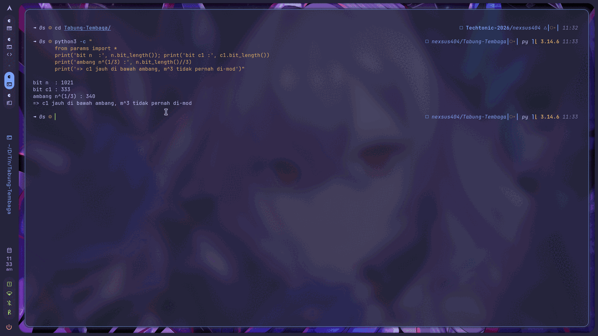
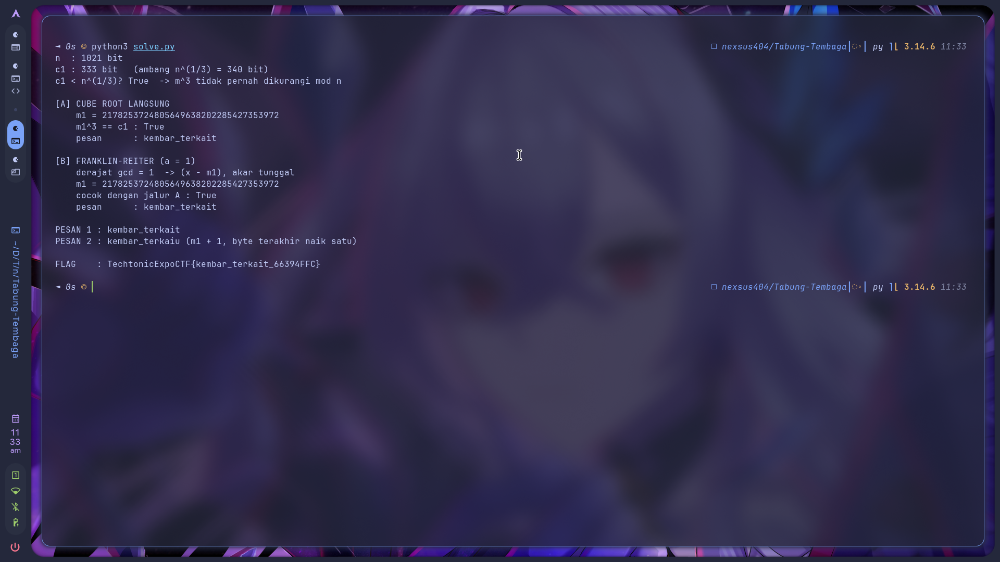
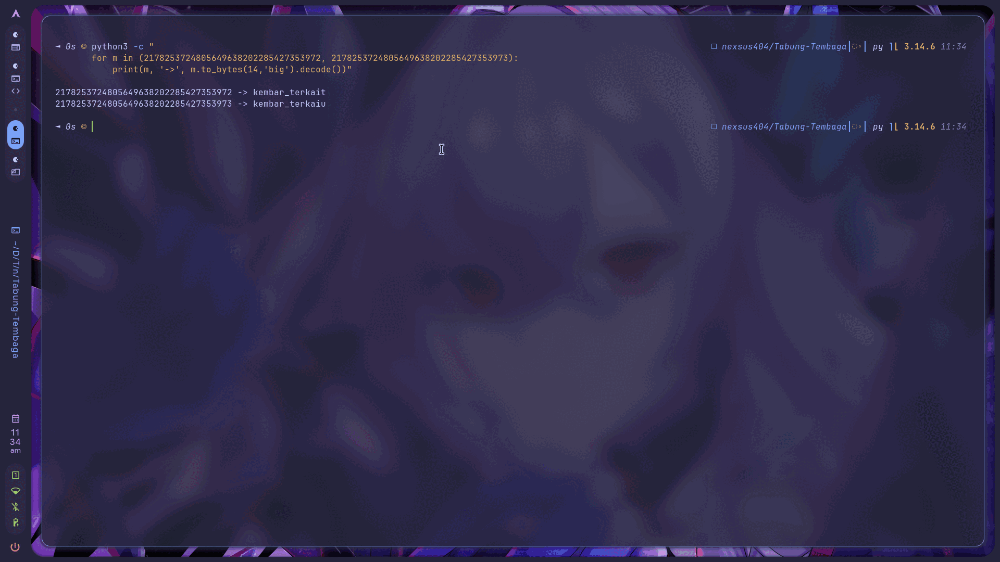

<!-- category: Cryptography | points: 689 -->
# Tabung Tembaga

Kategori: Cryptography (Eliminasi). 689 poin waktu saya kerjakan, awalnya 750, sudah 1 solve.
Service `http://168.110.219.59:5015`, dari `techtonicexpo.online/tantangan/14`.

Flag:

```
TechtonicExpoCTF{kembar_terkait_66394FFC}
```


## Soalnya

> Dua pesan terlahir dari akar yang sama. Pesan kedua hanya berselisih satu langkah dari yang pertama,
> dan keduanya dipanggang dengan pangkat tiga di dalam tabung yang sama.
>
> Dengan eksponen sekecil itu, dua teks sandi yang saling berkerabat bisa diadu hingga saling menguak.
> Selisih satu langkah sudah cukup untuk merobek keduanya.
>
> Bedah polinomnya, cari akar bersama, dan pesan pertama akan menampakkan diri.

Parameternya:

```
n  = 1275260566276744489586657928796077778931862729424816816531496673960724863907...
e  = 3
c1 = 10335354943553817684128269459125640869543408673459156221113376806064396203025084848809372118592586048
c2 = 10335354943553817684128269459125655103911277562519634088612780080817002159742722129877229347027178317
```

## Analisis awal

RSA dengan `e = 3` dan dua ciphertext berkerabat. Deskripsinya menyebut serangannya nyaris apa adanya:
"dipanggang dengan pangkat tiga di dalam tabung yang sama" berarti eksponen 3 dan modulus sama,
"pesan kedua hanya berselisih satu langkah" berarti `m2 = m1 + 1`, dan "bedah polinomnya, cari akar
bersama" itu Franklin-Reiter related-message attack.

Jadi jalur yang dimaksud sudah jelas. Tapi sebelum menulis aritmetika polinom di `Z_n[x]`, saya cek
satu hal dulu, ukuran ciphertext-nya:

```python
print('bit n :', n.bit_length())
print('bit c1:', c1.bit_length())
print('n^(1/3) bit :', n.bit_length()//3)
```

```
bit n : 1021
bit c1: 333
bit c2: 333
n^(1/3) bit : 340
```

Ini yang menentukan segalanya. `c1` cuma **333 bit**, sedangkan `m³` baru mulai terbungkus modulo kalau
melewati `n^(1/3) ≈ 340 bit`. Karena `c1` di bawah ambang itu, `m³` tidak pernah dikurangi mod `n` sama
sekali. Artinya `c1` bukan hasil aritmetika modular, tapi bilangan kubik biasa. Akar pangkat tiga bilangan
bulat langsung membukanya, tanpa Franklin-Reiter sama sekali.



## Prosesnya

**Jalur cepat: akar pangkat tiga langsung.**

Saya pakai binary search, bukan `round(c1 ** (1/3))`. Float 64-bit cuma punya 53 bit mantissa, sama sekali
tidak sanggup memegang 333 bit:

```python
def icbrt(x):
    lo, hi = 0, 1 << ((x.bit_length() + 2) // 3 + 2)
    while lo < hi:
        mid = (lo + hi) // 2
        if mid ** 3 < x: lo = mid + 1
        else: hi = mid
    return lo
```

```
m1 = 2178253724805649638202285427353972
m1^3 == c1 : True          <- kubik sempurna, konfirmasi tidak ada reduksi modulo
m2 = 2178253724805649638202285427353973
m2^3 == c2 : True
m2 - m1 = 1                <- persis "berselisih satu langkah"
```

Identitas selisihnya juga cocok, jadi `m2 = m1 + 1` bukan kebetulan:

```python
c2 - c1 == 3*m1**2 + 3*m1 + 1     # True
```

**Jalur yang dimaksud soal: Franklin-Reiter.**

Saya tetap implementasikan, bukan karena perlu, tapi karena flag-nya adalah hasil dekripsi. Tidak ada
server yang bisa saya tanya benar atau salah, jadi saya butuh metode kedua sebagai pembanding.

Karena `m2 = m1 + 1`, maka `m1` adalah akar bersama dari:

```
g1(x) = x³ − c1
g2(x) = (x + 1)³ − c2  =  x³ + 3x² + 3x + 1 − c2
```

Keduanya habis dibagi `(x − m1)`. Menghitung `gcd(g1, g2)` di `Z_n[x]` meruntuhkannya jadi polinom
derajat 1, dan setelah dijadikan monik, `m1` adalah negatif suku konstantanya:

```python
g1 = [(-c1) % n, 0, 0, 1]
g2 = [(1 - c2) % n, 3, 3, 1]
g  = polygcd(g1, g2, n)
g  = [(x * pow(g[-1], -1, n)) % n for x in g]
m1 = (-g[0]) % n
```

```
derajat gcd = 1  -> (x - m1), akar tunggal
m1 = 2178253724805649638202285427353972
cocok dengan jalur A : True
```

Dua metode independen, angka 34 digit yang identik. Baru setelah ini saya yakin.



Decode ke teks:

```python
m.to_bytes((m.bit_length() + 7) // 8, "big")
```

```
m1 -> b'kembar_terkait'
m2 -> b'kembar_terkaiu'
```

`m2` itu `m1` dengan byte terakhir naik satu, `t` (0x74) jadi `u` (0x75). Itu wujud fisik dari "pesan kedua
ditulis satu langkah setelah pesan pertama". Kata kuncinya pesan pertama.



## Tools

Python 3.14 saja. `int` presisi tak terbatas bawaan Python sudah cukup untuk semuanya, dan `pow(x, -1, n)`
di stdlib untuk invers modular.

Tidak perlu SageMath, `gmpy2`, maupun PyCryptodome. GCD polinom di `Z_n[x]` saya tulis manual sekitar 15
baris (`polymod` + `polygcd` di dalam [`solve.py`](solve.py)). Parameternya di [`params.py`](params.py).

```bash
python3 solve.py
```

```
n  : 1021 bit
c1 : 333 bit   (ambang n^(1/3) = 340 bit)
c1 < n^(1/3)? True  -> m^3 tidak pernah dikurangi mod n

[A] CUBE ROOT LANGSUNG
    m1^3 == c1 : True
    pesan      : kembar_terkait

[B] FRANKLIN-REITER (a = 1)
    derajat gcd = 1  -> (x - m1), akar tunggal
    cocok dengan jalur A : True
    pesan      : kembar_terkait
```

## Yang gagal

Awalnya saya hampir langsung menulis Franklin-Reiter tanpa cek ukuran. Bukan salah, tapi itu 40 baris
aritmetika polinom untuk sesuatu yang sebenarnya selesai dengan satu binary search.

`round(c1 ** (1/3))` sebagai akar kubik: gagal. Dan ini gagal secara diam-diam, yang bikin berbahaya.
Fungsi itu tidak error, ia mengembalikan angka yang kelihatan wajar. Yang membongkarnya cuma pengecekan
`m**3 == c1`. Sejak itu saya selalu verifikasi akar bilangan besar dengan mengalikannya balik.

Asumsi bahwa `c1` hasil reduksi mod `n`: salah, dibantah oleh `c1.bit_length() = 333 < 340`. Kalau saya
teruskan, waktu habis mengejar akar kubik modular yang tidak pernah ada.

## Yang saya ambil dari soal ini

Pelajaran utamanya: ukur dulu, baru pilih senjata. Deskripsi soal mengarahkan ke Franklin-Reiter dan itu
memang benar, tapi satu perbandingan `c1.bit_length()` vs `n.bit_length()//3` menunjukkan serangan yang
jauh lebih murah sudah cukup. Petunjuk panitia menjelaskan **desain** soal, bukan selalu jalur termurah
untuk memecahkannya.

Kebiasaan yang mau saya bawa: pada tiap soal RSA eksponen kecil, bandingkan `len(c)` dengan `len(n)/e`
lebih dulu. `e = 3` dengan `m³ < n` adalah kegagalan RSA tanpa padding yang klasik, operasi "modular"-nya
tidak pernah benar-benar modular. Dan itu terbaca gratis dari panjang bit sebelum satu baris serangan pun
ditulis.

Satu hal yang mengubah pandangan saya: Franklin-Reiter ternyata tidak butuh library berat. Saya kira wajib
SageMath, padahal intinya cuma GCD Euclid pada polinom dengan koefisien mod `n`. Satu-satunya operasi
non-sepele adalah invers modular untuk koefisien pemimpin, dan itu sudah ada di stdlib sejak Python 3.8.
Bonusnya, kalau invers itu gagal, `gcd` yang muncul justru memfaktorkan `n`, jadi kegagalannya pun menang.

Terakhir: untuk soal yang flag-nya hasil dekripsi, tidak ada oracle yang bisa dipakai mengecek. Jadi metode
kedua itulah oracle-nya. Verifikasi silang cuma butuh 15 baris tambahan dan meniadakan seluruh keraguan
sebelum submit.

<!--
Cek isi minimal panitia:
  1. judul + kategori     -> heading + baris kategori
  2. flag                 -> di atas
  3. analisis awal        -> "Analisis awal"
  4. langkah penyelesaian -> "Prosesnya"
  5. tools / script       -> "Tools" + solve.py + params.py
  6. trial-and-error      -> "Yang gagal"
  7. insight / teknik     -> "Yang saya ambil dari soal ini"
-->
