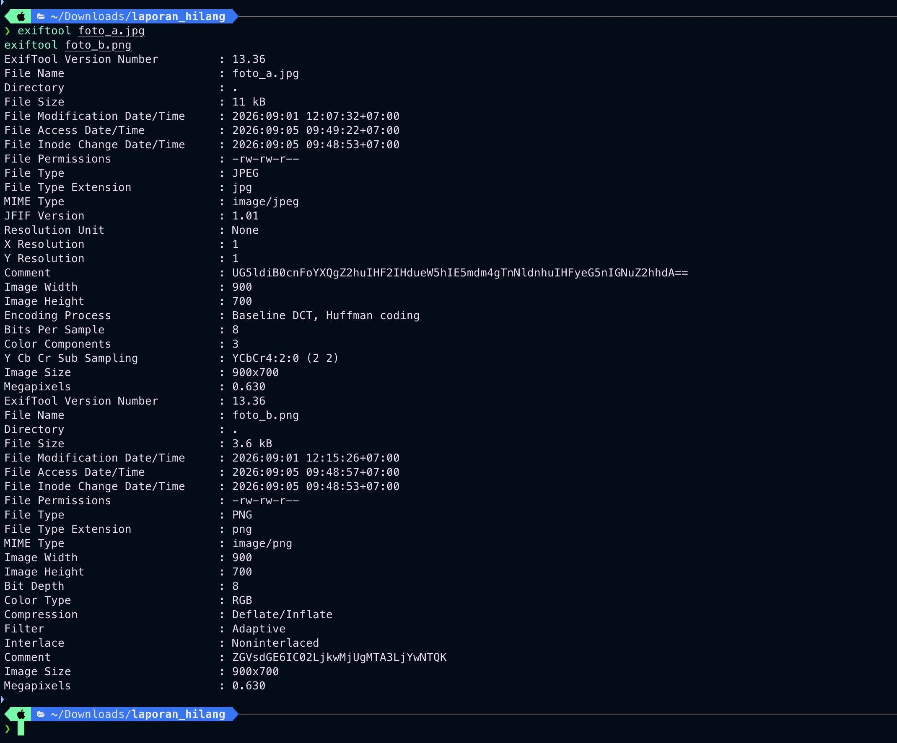
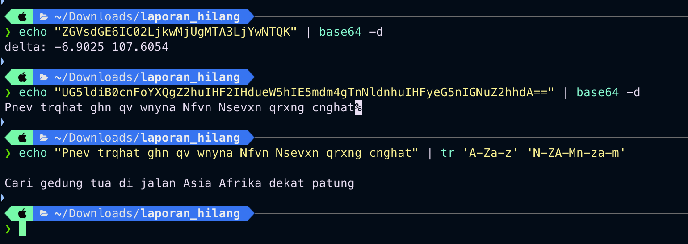

<!-- category: <kategori> | points: <poin> -->
# <Nama Soal>

| | |
| :--- | :--- |
| **Challenge** | Titik Koordinat |
| **Kategori** | osint  |
| **Poin** | <poin> |
| **Author** | <author kalau ada> |
| **Connection** |Lampiran laporan_hilang (catatan.txt, config.json, obrolan.txt, foto_a.jpg, foto_b.png)|
| **Solver** | sanzxcte |
| **Status** | Solved |

> Seorang mahasiswa bernama Dimas dilaporkan hilang setelah pamit pergi ke "kota lama" pada Minggu malam. Satu-satunya aset yang kamu miliki adalah arsip dari ponselnya: obrolan terakhir dengan Rina, catatan singkat, riwayat pencarian di aplikasi peta, serta dua foto yang sempat ia ambil.
Tugas kamu sebagai analis:
1. Bongkar arsip dan identifikasi petunjuk lokasi yang tersebar.
2. Perhatikan bahwa metadata foto bisa menyimpan pesan, dan koordinat mungkin tidak langsung terbaca - ada yang disembunyikan.
3. Gabungkan semua petunjuk untuk menentukan titik lokasi secara spesifik, lalu hitung koordinat sebenarnya.

Kunci adalah koordinat lokasi dalam format desimal tanpa spasi, contoh: -6.1234107.45678

![soal]


---

## 1. Flag

```
TechtonicExpoCTF{-6.9025107.6054_66394FFC}
```

> Flag **case-sensitive**. Tidak ada spasi/karakter tambahan saat submit.

---

## 2. Analisis Awal

Panitia memberikan sekumpulan arsip digital yang merekam aktivitas terakhir korban bernama Dimas sebelum hilang di Kota Bandung.

- **Yang dikasih:** <Arsip file teks (catatan.txt, config.json, obrolan.txt) dan file gambar (foto_a.jpg, foto_b.png).>
- **Observasi pertama:** <File teks memberikan petunjuk naratif mengenai rute perjalanan Dimas (Jl. Setiabudhi, Dago, kawasan gedung tua bekas bank Belanda di Asia Afrika). File gambar>
- **Hipotesis awal:** <Metadata foto menyimpan pesan rahasia yang memuat koordinat atau instruksi spesifik untuk membentuk format flag yang diminta.>

```bash
cat catatan.txt
cat config.json
cat obrolan.txt
```

![recon]


---

## 3. Langkah Penyelesaian

Membaca isi teks untuk merangkum kronologi dan target lokasi pencarian Dimas.

### 3.1 <Recon / enumerasi>

```bash
cat catatan.txt
cat config.json
cat obrolan.txt
```

Hasil: <catatan.txt: Dimas berangkat dari Jl. Setiabudhi, mampir ke Dago, menuju gedung tua di kawasan Bandung, terakhir online pukul 21.47 WIB.>
<config.json: Riwayat pencarian peta mencakup kata kunci gedung tua, bank belanda, asia afrika, dan patung.>
<obrolan.txt: Pukul 21.40 Dimas mengonfirmasi sudah sampai di gedung yang besar dan di depannya ada patung.>

### 3.2 <Menemukan celah / titik lemah>
Memeriksa metadata EXIF pada kedua file foto untuk mencari petunjuk tersembunyi.
```bash
exiftool foto_a.jpg
exiftool foto_b.png
```

Hasil: 
<foto_a.jpg memiliki bagian Comment berisi string Base64: UG5ldiB0cnhqYXQgZ2huIHF2IHdueW5hIE5mdm4gTnNldnhuIHFyeG5nIGNuZ2hhdA==>

<foto_b.png memiliki bagian Comment berisi string Base64: ZGVsdGE6IC02LjkwMjUgMTA3LjYwNTQK yang mendekode langsung menjadi koordinat delta.>



### 3.3 <Eksploitasi / dekripsi / ekstraksi>
Melakukan dekode Base64 serta enkripsi sandi geser (ROT13) pada string metadata.
```bash
echo "ZGVsdGE6IC02LjkwMjUgMTA3LjYwNTQK" | base64 -d
echo "UG5ldiB0cnFoYXQgZ2huIHF2IHdueW5hIE5mdm4gTnNldnhuIHFyeG5nIGNuZ2hhdA==" | base64 -d
echo "Pnev trqhat ghn qv wnyna Nfvn Nsevxn qrxng cnghat" | tr 'A-Za-z' 'N-ZA-Mn-za-m'
```
Koordinat desimal yang ditemukan dari delta metadata adalah -6.9025 dan 107.6054. Menggabungkannya tanpa spasi sesuai format contoh soal menghasilkan -6.9025107.6054, yang kemudian dibungkus ke dalam format wrapper flag kompetisi.

Flag : TechtonicExpoCTF{-6.9025107.6054_66394FFC}

![exploit]


---

## 4. Tools & Script yang Digunakan

| Tool | Versi | Dipakai untuk |
| :--- | :--- | :--- |
| <ExifTool> | <13.36> | <Mengekstrak metadata tersembunyi pada file gambar (foto_a.jpg dan foto_b.png)> |
| <Base64 Decoder> | <Built-in> | <Menerjemahkan string Comment metadata foto> |
| <ROT13 Decoder> | <Built-in> | <Membaca sandi geser teks petunjuk lokasi> |
=

---

## 5. Trial-and-Error / Langkah yang Gagal

Jujur catat yang dicoba tapi mentok, plus alasan gagalnya.

| # | Yang dicoba | Hasil | Kenapa gagal |
| :-- | :--- | :--- | :--- |
| 1 | <Mencari koordinat manual via Google Maps tanpa membaca metadata> | Gagal | <Titik lokasi terlalu luas karena kawasan Asia Afrika memiliki banyak gedung kolonial bersejarah.> |
| 2 | <Hanya mendekode Base64 foto_a.jpg tanpa ROT13> | Gagal | <Hasil dekode masih berupa ciphertext acak yang belum bisa dibaca sebagai instruksi lokasi.> |
| 3 | <Menggabungkan koordinat dengan spasi atau format titik dua> | **Berhasil** | <Gagal pada percobaan awal sebelum membaca instruksi format soal yang meminta format desimal tanpa spasi (contoh: -6.1234107.45678).> |

---


<!--
=========================== CHECKLIST SEBELUM SUBMIT ===========================
Isi minimal (slide "Format dan Isi Write-up"):
  [ ] 1. Judul dan kategori challenge        -> tabel info + metadata baris 1
  [ ] 2. Flag yang ditemukan                 -> bagian 1
  [ ] 3. Analisis awal                       -> bagian 2
  [ ] 4. Langkah penyelesaian                -> bagian 3
  [ ] 5. Tools atau script yang digunakan    -> bagian 4
  [ ] 6. Trial-and-error / langkah gagal     -> bagian 5
  [ ] 7. Insight utama atau teknik unik      -> bagian 6

Batas teknis platform:
  [ ] Maksimum 2 MB per file  (cek: du -h WRITEUP.md ; du -sh img/)
  [ ] Format PDF / TXT / Markdown / gambar / ZIP  (rekomendasi panitia: PDF)
  [ ] 1 write-up untuk 1 tim + 1 challenge (jangan digabung)
  [ ] Upload SETELAH flag berhasil didapat
  [ ] Status awal setelah upload: "menunggu review"

Screenshot standar (taruh di img/, path relatif):
  01-soal.png     halaman challenge di platform: judul, kategori, poin, deskripsi
  02-recon.png    output perintah recon pertama
  03-analisis.png bukti celah/temuan yang bikin soal kebuka
  04-exploit.png  solver/exploit lagi jalan
  05-flag.png     flag muncul + notifikasi "Correct" di platform
===============================================================================
-->
